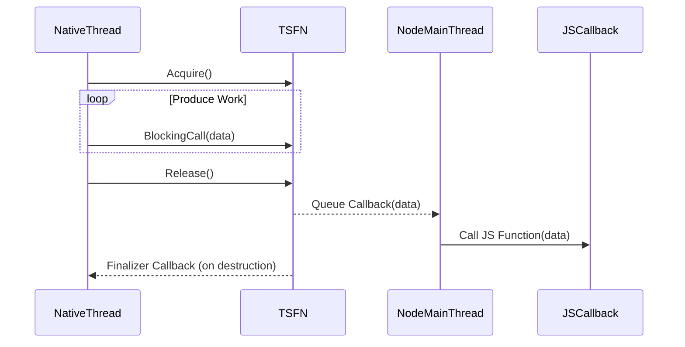

# Threadsafe Functions and Safe Cross-Thread Calls

This documentation details the **thread-safe function APIs** provided by the node-addon-api, enabling native threads created within a Node.js addon to safely invoke JavaScript callbacks. It covers the creation, use, lifetime management, and advanced behavior of both `Napi::ThreadSafeFunction` and `Napi::TypedThreadSafeFunction`, helping you integrate thread-safe asynchronous workflows.

---

## Understanding the Challenge: Why Thread-Safe Functions?

In Node.js addons, JavaScript functions must be called from the main event loop thread, not from arbitrary native threads. When you create additional native threads in your addon—such as worker threads to perform background processing—calling JS functions from those threads directly leads to unsafe behavior and crashes.

**Thread-safe functions** solve this by allowing native threads to queue requests that the main Node.js thread will handle asynchronously, ensuring safe, serialized execution of JavaScript callbacks.

---

## Types of Thread-Safe Functions

The node-addon-api offers two thread-safe function APIs:

### 1. `Napi::ThreadSafeFunction`
- Supports dynamic callbacks for each queued item.
- Enables passing different C++ data types per call.
- Acts as a "broker," wrapping each callback dynamically.
- Has some additional overhead, and possible memory leak risks when dynamically allocated data is not cleaned up.

### 2. `Napi::TypedThreadSafeFunction`
- A newer, templated API with static, compile-time typing.
- Designed with Node-API 5+ support for optional JavaScript callbacks.
- Callback and context are fixed at creation, improving type safety.
- Supports cleaner and safer resource management, including proper cleanup for queued but not-executed items.

<Check>
`TypedThreadSafeFunction` is recommended when you need static typing, fixed callbacks, and robust cleanup capabilities. Otherwise, `ThreadSafeFunction` remains available for dynamic use cases.
</Check>

---

## Creating Thread-Safe Function Instances

### `Napi::ThreadSafeFunction::New`

Creates a thread-safe function that takes a JavaScript callback and manages a queue to schedule calls safely on the main thread.

```cpp
Napi::ThreadSafeFunction tsfn = Napi::ThreadSafeFunction::New(
  env,                      // The addon environment
  jsCallback,               // JS function to call asynchronously
  resourceObject,           // Async resource object for async_hooks (optional)
  "Resource Name",        // Name identifier for diagnostics
  maxQueueSize,             // Maximum number of queued calls (0 = unlimited)
  initialThreadCount,       // Number of threads using the TSFN
  context,                  // Context data (optional)
  finalizeCallback,         // Cleanup callback invoked on destruction (optional)
  finalizeData              // Data to pass to finalizeCallback (optional)
);
```

### `Napi::TypedThreadSafeFunction::New`

A templated constructor with strongly typed context and data:

```cpp
auto tsfn = Napi::TypedThreadSafeFunction<ContextType, DataType, Callback>::New(
  env,
  jsCallback,               // Optionally nullptr for no JS callback
  resourceObject,           // Optional async resource
  "Resource Name",
  maxQueueSize,
  initialThreadCount,
  context,
  finalizeCallback,         // Optional finalizer
  finalizeData              // Optional data for finalizer
);
```

The template parameters represent:
- `ContextType`: The context for the TSFN that will be passed to your callback.
- `DataType`: The type of data passed to the callback per invocation.
- `Callback`: The C++ function callback signature handling JS invocation.

---

## Managing the Thread-Safe Function Lifecycle

### Acquire

When a new native thread intends to use the thread-safe function, call `Acquire()` to increase the internal thread count:

```cpp
napi_status status = tsfn.Acquire();
```

**Returns:**
- `napi_ok` on success
- `napi_closing` if the TSFN is closed and no longer usable

### Release

When a native thread no longer needs the TSFN, call `Release()`:

```cpp
napi_status status = tsfn.Release();
```

**Important:** After calling `Release()`, the calling thread must not use the TSFN again as it may be destroyed.

**Returns:**
- `napi_ok` on success
- `napi_invalid_arg` if the thread count is zero
- `napi_generic_failure` on other errors

### Abort

Immediately closes the TSFN, causing all further calls (except `Release()`) to fail with `napi_closing`:

```cpp
napi_status status = tsfn.Abort();
```

This allows native threads to detect shutdown conditions and stop queuing calls.

---

## Calling JavaScript from Native Threads

### BlockingCall / NonBlockingCall

To invoke the associated JavaScript callback from native threads, queue calls using:

- `BlockingCall()`: Blocks if the queue is full until space is available.
- `NonBlockingCall()`: Returns immediately with `napi_queue_full` if the queue is full.

```cpp
napi_status status = tsfn.BlockingCall(dataPointer);
```

or, for `Napi::ThreadSafeFunction`, with a native callback:

```cpp
tsfn.BlockingCall(dataPointer, [](Napi::Env env, Napi::Function jsCallback, DataType* data) {
  // Convert native data to JS and invoke callback
  jsCallback.Call({Napi::Number::New(env, *data)});
  delete data;
});
```

**Return values:**
- `napi_ok`: Call safely queued.
- `napi_queue_full`: Queue is full (for non-blocking call).
- `napi_closing`: TSFN aborted or released.
- `napi_invalid_arg`: TSFN closed.
- `napi_generic_failure`: Other errors.

---

## Practical Example: Using `Napi::ThreadSafeFunction`

Here is a native addon example that starts a native thread and invokes a JavaScript callback every second:

```cpp
#include <chrono>
#include <thread>
#include <napi.h>

using namespace Napi;

std::thread nativeThread;
ThreadSafeFunction tsfn;

Value Start(const CallbackInfo& info) {
  Napi::Env env = info.Env();

  if (info.Length() < 2 || !info[0].IsFunction() || !info[1].IsNumber()) {
    throw TypeError::New(env, "Expected a function and a number");
  }

  int count = info[1].As<Number>().Int32Value();

  tsfn = ThreadSafeFunction::New(
    env,
    info[0].As<Function>(),  // JavaScript callback
    "Resource Name",
    0,  // Unlimited queue
    1,  // One thread
    [](Env) { nativeThread.join(); }  // Finalizer to join thread
  );

  nativeThread = std::thread([count] {
    for (int i = 0; i < count; i++) {
      int* value = new int(clock());
      napi_status status = tsfn.BlockingCall(value, [](Env env, Function jsCallback, int* data) {
        jsCallback.Call({Number::New(env, *data)});
        delete data;
      });
      if (status != napi_ok) break;
      std::this_thread::sleep_for(std::chrono::seconds(1));
    }
    tsfn.Release();
  });

  return Boolean::New(env, true);
}

Napi::Object Init(Napi::Env env, Napi::Object exports) {
  exports.Set("start", Napi::Function::New(env, Start));
  return exports;
}

NODE_API_MODULE(clock, Init)
```

### JavaScript Usage

```js
const { start } = require('bindings')('clock');

start(function(clockValue) {
  console.log('JavaScript callback called with value', clockValue);
}, 5);
```

This prints the `clock()` value every second, five times.

---

## Advanced Use: `Napi::TypedThreadSafeFunction`

`TypedThreadSafeFunction` aids with static type safety for context and data by leveraging template parameters:

```cpp
using Context = Napi::Reference<Napi::Value>;
using DataType = int;

void CallJs(Napi::Env env, Napi::Function callback, Context* context, DataType* data) {
  if (env != nullptr && callback != nullptr) {
    callback.Call(context->Value(), {Napi::Number::New(env, *data)});
  }
  delete data;
}

using TSFN = Napi::TypedThreadSafeFunction<Context, DataType, CallJs>;

TSFN tsfn = TSFN::New(
  env,
  jsCallback,
  "Resource Name",
  0,              // Unlimited queue
  1,              // One thread
  contextPtr,     // Context pointer
  finalizer,      // Finalizer function
  finalizeDataPtr // Data passed to finalizer
);

// Use tsfn.BlockingCall and tsfn.Release as needed
```

This ensures type safety at compile time and better lifetime management.

---

## Key Considerations and Best Practices

- **Always call `Release()`** on threads that finish using the thread-safe function to avoid leaks or deadlocks.

- **Avoid using `ThreadSafeFunction` after `Release()` or `Abort()`** in a thread; behavior is undefined.

- When using `ThreadSafeFunction::NonBlockingCall()`, be prepared to handle `napi_queue_full` and implement retry/backoff as needed.

- Ensure your **finalizer cleans up native resources** such as joining threads and freeing allocated data.

- If you need **per-call cleanup**, prefer `TypedThreadSafeFunction` which calls the callback with empty environments to finalize any pending data.

- Use **`TypedThreadSafeFunction`** if your callback is static and you want compile-time type checks and proper finalization.

---

## Troubleshooting

- If you experience **memory leaks**, check you are correctly releasing or aborting thread-safe functions and properly freeing all dynamically allocated data.

- Deadlocks can occur if the native threads don't release the TSFN or if the finalizer does not join threads.

- Calls failing with `napi_closing` indicate the TSFN has been aborted or fully released and is no longer usable.

- For integration errors, verify your Node.js version supports the necessary Node-API APIs (4+ for basic, 5+ for typed TSFN).

---

## Further Reading and Related Topics

- [ThreadsafeFunction API Detailed Reference](threadsafe_function.md)
- [TypedThreadSafeFunction API Detailed Reference](typed_threadsafe_function.md)
- [Threadsafe Functions Overview and API Differences](threadsafe.md)
- [Async Workers and Execution Models](async-workers.md)
- [Error Handling and Exception Propagation](error-exceptions.md)

---

## Diagram: Threadsafe Function Usage Flow



This depicts how native threads acquire, use, and release the thread-safe function, queuing JS callbacks for the main thread to execute safely.

---

This guide empowers you to safely integrate multi-threaded native code with JavaScript callbacks using the node-addon-api's thread-safe function interfaces.
