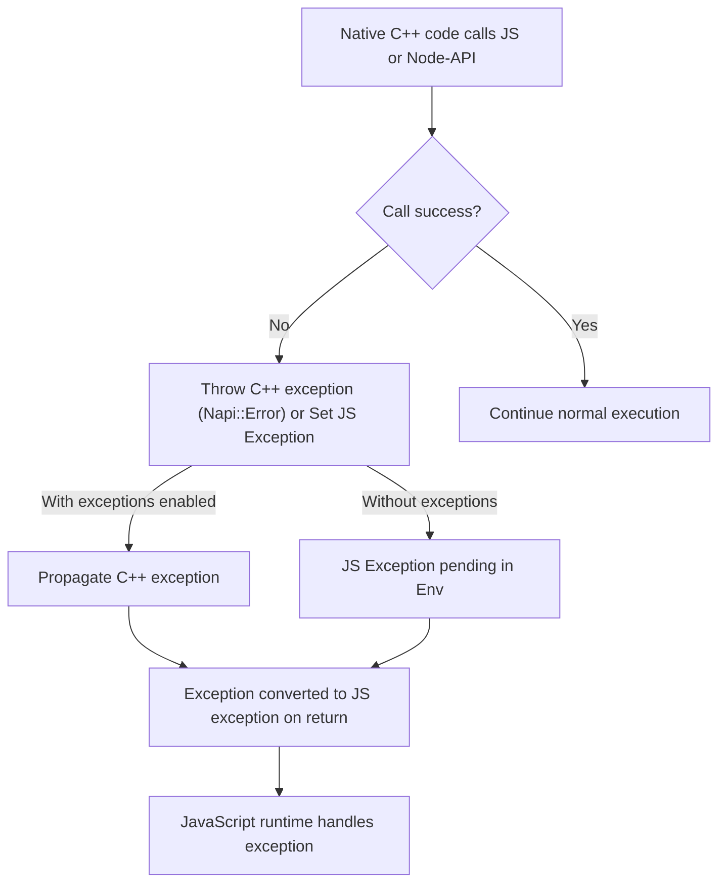

# Error Handling and Exception Propagation

This page explores how **node-addon-api** manages errors and exceptions bridging the boundary between C++ and JavaScript. It guides you on raising, propagating, and handling errors effectively in native Node.js addons using this C++ wrapper, illustrating custom error types, error reporting, and how C++ exceptions map to JavaScript exceptions.

---

## Understanding the Error Handling Model

When developing native addons, managing errors correctly is critical to ensure your addon behaves predictably and integrates smoothly with JavaScript. **node-addon-api** offers a layered approach:

- **With C++ exceptions enabled**, you write idiomatic C++ code that can throw and catch exceptions which are automatically translated to JS exceptions.
- **Without C++ exceptions**, the API uses `Maybe` types and explicit environment checks to deal with errors without throwing, allowing manual error checking and propagation.

This dual mode lets you choose the error handling strategy that best fits your build and runtime environment.

---

## Key Error Classes

### Napi::Error

This class represents JavaScript error objects in C++. When exceptions are enabled, `Napi::Error` inherits from `std::exception`, allowing seamless throw/catch semantics. When disabled, it manages JS exceptions explicitly without C++ throw.

Common specialized error types include:

- `Napi::TypeError`
- `Napi::RangeError`
- `Napi::SyntaxError`

Using these specialized error classes improves clarity and consistency with JS semantics.

---

## Handling Errors With C++ Exceptions Enabled

Enabling C++ exceptions (`NAPI_CPP_EXCEPTIONS`) integrates C++ exception handling directly with JavaScript exceptions, streamlining error propagation.

- If a node-addon-api call detects an invalid argument or failure, it throws a `Napi::Error` exception.
- JavaScript exceptions thrown from JS callbacks invoked by native code are converted to `Napi::Error` C++ exceptions.
- When a `Napi::Error` exception escapes a native callback, it is automatically propagated as a JavaScript exception.
- Custom C++ exceptions can be captured and converted to JavaScript exceptions depending on your build dependency:
  - Using `node_addon_api_except` handles only `Napi::Error` exceptions.
  - Using `node_addon_api_except_all` catches all exceptions. `std::exception` subclasses are converted with their `what()` message. Unknown exceptions produce a generic error.

### Throwing Exceptions

```cpp
Env env = ...;
throw Napi::Error::New(env, "Example of throwing a C++ exception");
// Code after throw will not execute
```

### Calling JS Functions that May Throw

```cpp
Napi::Function jsFunc = someValue.As<Napi::Function>();
Napi::Value result = jsFunc({ arg1, arg2 });
// If exception thrown, control is transferred via C++ exception
```

### Catching Exceptions

```cpp
try {
  Napi::Value result = jsFunc({ arg1, arg2 });
} catch (const Napi::Error& e) {
  std::cerr << "Caught JS exception: " << e.what() << std::endl;
  // Handle error or rethrow
}
```

This catch prevents the exception from propagating as a JS exception.

---

## Handling Errors With C++ Exceptions Disabled

When C++ exceptions are disabled (common in some build environments), node-addon-api provides error handling using _Maybe_ types and explicit checks.

- Calls that may fail return `Maybe<T>` types which clients must check before using the value.
- If a `Maybe` is empty (`IsNothing()`), it indicates a pending JavaScript exception.
- Pending exceptions can be retrieved and cleared with environment methods like `GetAndClearPendingException()`.

### Throwing JS Exceptions

```cpp
Napi::Env env = ...;
Napi::Error::New(env, "Example JS exception").ThrowAsJavaScriptException();
return;
```

### Checking JS Exceptions After Calls

```cpp
Maybe<Napi::Value> maybeResult = jsFunction({ arg1, arg2 });
Napi::Value result;
if (!maybeResult.To(&result)) {
  // Exception pending. Clean up and return.
  return env.Undefined();
}
// Use result safely
```

### Handling Exceptions Explicitly

```cpp
if (maybeResult.IsNothing()) {
  Napi::Error e = env.GetAndClearPendingException();
  std::cerr << "Caught exception: " << e.Message() << std::endl;
}
```

Clearing stops the exception from propagating.

---

## Propagating Errors in Both Modes

The typical error propagation pattern is:

1. Detect error condition or exception.
2. Clean up any resources.
3. Report error by throwing or returning a deferred exception.
4. Return immediately from the native method so the JS exception can propagate.

Delaying returns after throwing exceptions can lead to undefined behavior.

---

## Integrating with Node-API and Macros

When calling raw Node-API functions directly, node-addon-api provides macros to simplify error checking:

| Macro                       | Description                                                                                                  |
|-----------------------------|--------------------------------------------------------------------------------------------------------------|
| `NAPI_THROW(e, returnValue)` | Throws a `Napi::Error` and returns `returnValue`. Ignored if exceptions enabled.                            |
| `NAPI_THROW_IF_FAILED(env, status, returnValue)` | Throws error from `napi_status` if failure, returns `returnValue`.                                         |
| `NAPI_THROW_IF_FAILED_VOID(env, status)` | Throws error from `napi_status` and returns void.                                                           |
| `NAPI_FATAL_IF_FAILED(status, location, message)`| Fails fatally on error with custom message and location.                                                    |

These macros adapt behavior based on exception support in your build.

---

## Practical Tips and Best Practices

- **Enable C++ exceptions** if possible for simpler, natural error handling.
- Always return immediately after throwing or detecting an exception to avoid crashes.
- Use `Napi::Error` derived classes for specific error semantics.
- Check `Maybe` values when exceptions are disabled to avoid silent failures.
- Clear exceptions when caught explicitly to prevent propagation.
- Configure your build via the `binding.gyp` dependencies to control exception handling strategy (see [Setup](setup.md)).

---

## Example: Handling Exceptions in a Native Method

```cpp
Napi::Value CallJsFunction(const Napi::CallbackInfo& info) {
  Env env = info.Env();
  Napi::Function jsFunction = info[0].As<Napi::Function>();

  #ifdef NAPI_CPP_EXCEPTIONS
  try {
    return jsFunction.Call(info.This(), {});
  } catch (const Napi::Error& e) {
    // Log error or transform, then rethrow or return JS exception
    std::cerr << "Caught JS exception in C++: " << e.what() << std::endl;
    throw;
  }
  #else
  Maybe<Napi::Value> maybeResult = jsFunction.Call(env.Global(), {});
  Napi::Value result;
  if (!maybeResult.To(&result)) {
    Napi::Error e = env.GetAndClearPendingException();
    std::cerr << "JS exception was pending: " << e.Message() << std::endl;
    return env.Undefined();
  }
  return result;
  #endif
}
```

This example demonstrates conditional error handling based on the exception mode.

---

## Summary Diagram of Error Flow



---

## Troubleshooting Common Issues

- **Exception not propagating to JS:** Ensure you return immediately after throwing an exception or setting one on the environment.
- **Process crashing on exception:** Confirm you have enabled C++ exceptions properly in your build configuration.
- **Unexpected exception messages:** Use `node_addon_api_except_all` to handle all C++ exceptions gracefully.
- **Silent failures in no-exception mode:** Always check `Maybe` types and environment exception status.

---

## Further Reading and References

- [Setup and Build Environment Configuration](setup.md) for enabling exception handling in `binding.gyp`.
- [Napi::Error](error.md) and its subclasses for error object manipulation.
- [JavaScript Callback Handling and Exception Propagation](callbackinfo.md).
- Related guide: [Error Handling & Exception Propagation (Concepts)](/concepts/architecture-overview/exception-handling).

---

This section equips you with the knowledge to write robust native addons that communicate errors clearly across C++ and JavaScript using **node-addon-api**'s rich exception management capabilities.