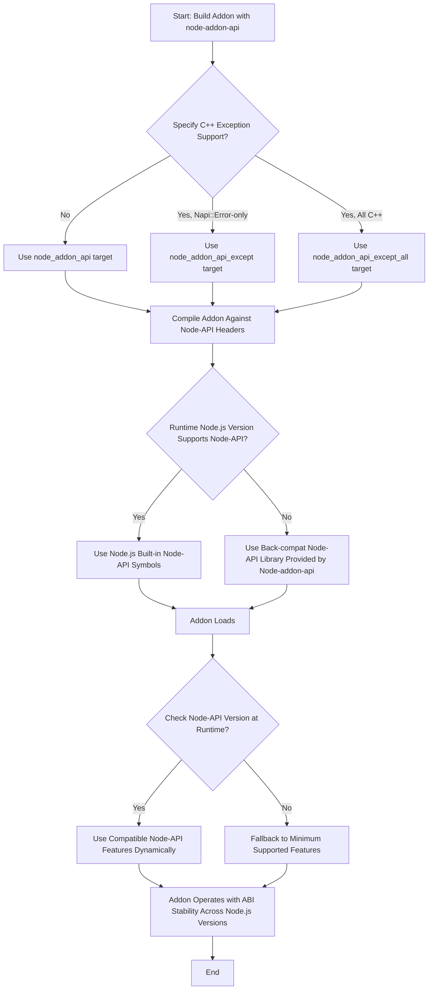

# Node-API Versioning and Compatibility

Understanding Node-API version support and Node.js compatibility is essential for building native addons that are reliable, maintainable, and broadly usable across Node.js environments. This page explains how node-addon-api interacts with Node-API versions, how it ensures ABI stability, and best practices to target multiple Node.js versions with a single addon build.

---

## Why Node-API Versioning Matters

Node-API (N-API) provides a stable ABI for native addons across Node.js versions. Each Node-API version introduces capabilities while maintaining backward compatibility. Through version management, addons can:

- Determine which Node-API features are available in the runtime environment
- Adapt to different Node.js versions seamlessly
- Avoid recompilation for each Node.js release, enhancing developer experience and user adoption

Node-addon-api builds upon Node-API by offering C++ wrapper classes that maintain ABI stability and support a range of Node.js versions.

<Tip>
Using Node-API version checks ensures your addon gracefully handles feature availability and provides fallbacks, maximizing compatibility and minimizing runtime errors.
</Tip>

## Retrieving Node-API and Node.js Version Information

node-addon-api exposes methods to programmatically query the highest supported Node-API version and detailed Node.js version data for the current runtime environment.

### Key Methods in `Napi::VersionManagement`

| Method             | Description                                     | Signature Example                                    |
|--------------------|------------------------------------------------|-----------------------------------------------------|
| `GetNapiVersion`   | Gets the highest Node-API version supported     | `static uint32_t GetNapiVersion(Napi::BasicEnv env)` |
| `GetNodeVersion`   | Retrieves Node.js version information           | `static const napi_node_version* GetNodeVersion(Napi::BasicEnv env)` |

#### Example Usage

```cpp
#include "napi.h"

using namespace Napi;

Value getNapiVersion(const CallbackInfo& info) {
  Env env = info.Env();
  uint32_t napi_version = VersionManagement::GetNapiVersion(env);
  return Number::New(env, napi_version);
}

Value getNodeVersion(const CallbackInfo& info) {
  Env env = info.Env();
  const napi_node_version* node_version = VersionManagement::GetNodeVersion(env);
  Object version = Object::New(env);
  version.Set("major", Number::New(env, node_version->major));
  version.Set("minor", Number::New(env, node_version->minor));
  version.Set("patch", Number::New(env, node_version->patch));
  version.Set("release", String::New(env, node_version->release));
  return version;
}

Object InitVersionManagement(Env env) {
  Object exports = Object::New(env);
  exports["getNapiVersion"] = Function::New(env, getNapiVersion);
  exports["getNodeVersion"] = Function::New(env, getNodeVersion);
  return exports;
}
```

This pattern allows your addon to adapt dynamically based on runtime version capabilities.

---

## Node-API Version Compatibility and Addon Support

Node-addon-api targets active LTS Node.js versions, supporting the Node-API versions they implement. This focus ensures addons are optimized for the latest stable environments without excessive legacy overhead.

### Compatibility Model Highlights

- The oldest Node.js version supported by the current node-addon-api release is Node.js 18.x.
- Addons are compiled against Node-API versions available at build time but load dynamically across supported Node.js versions.
- Back-compat Node-API functionality is linked only if the target Node.js runtime does not natively support the required Node-API version.

### Using Version Badges

To communicate support guarantees clearly, node-addon-api encourages addon maintainers to display Node-API version badges in their repositories or documentation. These badges succinctly show the minimum Node-API version required, helping users understand compatibility at a glance.

Example badges:

  

Refer to the [Node-API support matrix](https://nodejs.org/dist/latest/docs/api/n-api.html#node-api-version-matrix) for exact mapping of Node-API versions to Node.js releases.

---

## Practical Guidance for Targeting Multiple Node.js Versions

Creating an addon that supports multiple Node.js versions with a single build requires careful planning and build configuration.

### 1. Configure Your Build to Link Node-API Properly

In your `binding.gyp`, declare dependencies on node-addon-api targets appropriate for the exception-handling strategy and Node-API support:

```gyp
'dependencies': [
  "<! (node -p \"require('node-addon-api').targets\")": "node_addon_api",
],
```

You can replace `node_addon_api` with variants like `node_addon_api_except` or `node_addon_api_except_all` depending on whether and how you want to integrate C++ exceptions.

### 2. Use Preprocessor Directives to Guard Deprecated APIs

To avoid including deprecated Node-API functions that could break compatibility, define:

```cpp
#define NODE_ADDON_API_DISABLE_DEPRECATED
#include "napi.h"
```

This ensures you’re using only supported APIs throughout your addon code.

### 3. Avoid Non-ABI-Stable Node.js Internal APIs

Ensure your native addon code includes only `napi.h` from node-addon-api and does not include Node.js internal headers like `node.h`, `nan.h`, or `v8.h`. This is essential for ABI stability across Node.js versions.

### 4. Query Runtime Node-API Version to Adjust Behavior If Needed

At runtime, dynamically query the supported Node-API version to conditionally enable newer features, providing fallbacks for older runtimes.

### 5. Conditional Compilation for Platform-Specific Builds

When targeting macOS, include the following in your `binding.gyp` to set symbol visibility, improving binary size and security:

```gyp
'conditions': [
  ['OS=="mac"', {
      'cflags+': ['-fvisibility=hidden'],
      'xcode_settings': {
        'GCC_SYMBOLS_PRIVATE_EXTERN': 'YES',
      }
  }]
]
```

---

## Best Practices and Tips

- **Enable C++ exceptions cautiously:** Opt for the node-addon-api variant corresponding to your addon’s exception handling needs. Fully enabling exceptions (`node_addon_api_except_all`) permits all C++ exceptions but requires careful design.

- **Use Node-API version checks at runtime:** This prevents invoking unavailable API methods on older runtimes, avoiding crashes.

- **Keep build dependencies minimal and precise:** Depend only on node-addon-api targets necessary for your use case.

- **Test across Node.js LTS versions:** Validate your addon builds and runs correctly on supported Node.js releases to catch compatibility issues early.

- **Display Node-API version badges:** Clearly communicate your addon’s compatibility to consumers.

---

## Troubleshooting Compatibility Issues

- **Build fails due to missing Node-API symbols:** Confirm target Node.js runtime supports your Node-API version or configure back-compat linking.

- **Deprecated API warnings or failures:** Define `NODE_ADDON_API_DISABLE_DEPRECATED` to exclude deprecated APIs.

- **Runtime crashes on older Node.js versions:** Add runtime checks using `Napi::VersionManagement` to detect and adapt to Node-API version.

- **Incompatibility with certain platforms:** Review build flags especially for macOS and Linux for platform-specific flags.

---

## Diagram: Node-addon-api Version Compatibility Flow



---

## Additional Resources

- [Node-API Version Matrix](https://nodejs.org/dist/latest/docs/api/n-api.html#node-api-version-matrix) – Detailed mapping of Node-API versions to Node.js releases.
- [Setup and Build System Integration](./setup-build.md) – Guide to configuring node-addon-api with build tools.
- [Error Handling and Exception Propagation](./error-exceptions.md) – Understanding exception handling strategies.
- [Getting Started: Installation Instructions](../../getting-started/setup-basics/install-instructions.md) – Step-by-step setup.
- [ABI Stability Guide](../README.md#abi-stability-guideline) – Explanation of why Node-API ensures ABI stability.

---

By comprehensively managing Node-API and Node.js version compatibility, your addon will serve the broadest user base without sacrificing reliability or requiring multiple builds—unlocking the full power and flexibility of native Node.js modules with confidence.
