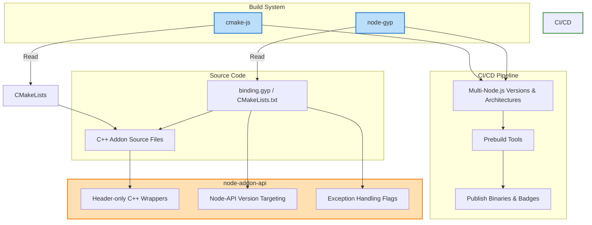

# Build Tooling and CI/CD Integration

Streamlining the build and continuous integration workflows for native Node.js addons is critical for reliable, portable, and maintainable delivery. This page helps you understand the core build systems supported by **node-addon-api**—notably `node-gyp` and `cmake-js`—alongside recommended practices for CI/CD integration and leveraging badge-driven version compatibility to ensure your addon works seamlessly across Node.js versions.

---

## Supported Build Systems

### Node-gyp: The Established Standard

`node-gyp` is the de facto build tool for native Node.js addons. It manages compiling your C++ sources into native binaries while ensuring proper linkage with Node.js headers and libraries across platforms.

- Uses a `binding.gyp` JSON-like file to declare build configurations.
- Handles compiler flags, dependencies, and platform-specific settings.
- Supports exception handling configuration, C++ standard enforcement, and custom targets.

**Key User Workflow:**

- Define your `binding.gyp` to declare your native addon target, sources, and dependencies.
- Include `node-addon-api` targets or variants depending on exception handling needs.
- Configure platform-specific compiler flags as necessary (macOS hidden symbol visibility, Windows exception handling).

```gyp
{
  "targets": [
    {
      "target_name": "myAddon",
      "sources": ["src/my_addon.cc"],
      "dependencies": [
        "<!@(node -p \"require('node-addon-api').targets\")"
      ],
      "defines": ["NAPI_CPP_EXCEPTIONS"],
      "conditions": [
        ["OS=='mac'", {
          "cflags+": ["-fvisibility=hidden"],
          "xcode_settings": {
            "GCC_SYMBOLS_PRIVATE_EXTERN": "YES"
          }
        }]
      ]
    }
  ]
}
```

---

### CMake-js: A Flexible Alternative

`cmake-js` provides a CMake-based alternative supporting modern C++ projects, enabling advanced build configurations and integrations.

- Allows existing CMake projects to build Node.js addons.
- Invokes native CMake scripts with Node.js specific targets.
- Ideal when your project already uses CMake or needs complex build logic.

Note: While `cmake-js` setups are less common, they are fully supported by **node-addon-api** and fit into automated CI pipelines similarly to `node-gyp`.


---

## Badge-Driven Compatibility and Versioning

**node-addon-api** encourages the use of badges to indicate the minimal supported Node-API version, clarifying compatibility across Node.js versions:

- Badges like  visibly communicate the minimum Node-API version your addon supports.
- These badges help maintainers and users quickly identify the addon’s compatibility.

Incorporate appropriate Node-API version targeting in your build configuration to ensure your build outputs are compatible with your target Node.js runtime versions.

---

## CI/CD Integration Best Practices

Integrate your native addon build process smoothly with continuous integration and deployment systems by following these best practices:

### 1. Define Clear Build Targets

Specify Node-API version and exception handling variants explicitly in your build configurations to produce predictable outputs.

### 2. Leverage Prebuild Tools

Use prebuild tools like `prebuild`, `node-pre-gyp`, or `prebuildify` to create and distribute precompiled binaries for multiple platforms and Node.js versions, saving your users from compilation pain.

### 3. Automation of Build Matrix

Configure your CI pipeline to build against multiple Node.js versions and target architectures. This ensures wide compatibility and reliability.

### 4. Platform-Specific Settings

Apply platform-specific compiler flags and environment setup (e.g., visibility flags on macOS, exception handling on Windows) within conditional sections of your build files.

### 5. Clear Output Artifacts

Publish binaries with clear naming and versioning, and maintain version badges in your documentation or README to communicate compatibility.

### Troubleshooting CI Builds

- Confirm your environment meets system requirements (Node.js version, compiler, OS).
- Validate `binding.gyp` configurations carefully for syntax errors or missing flags.
- Use the official troubleshooting guides linked below.

---

## Practical Example: Node-gyp Binding Configuration

Here is a minimal example of a `binding.gyp` snippet integrating **node-addon-api** with exception handling enabled:

```gyp
{
  "targets": [
    {
      "target_name": "myAddon",
      "sources": ["src/addon.cc"],
      "dependencies": [
        "<!@(node -p \"require('node-addon-api').targets\")"
      ],
      "defines": ["NAPI_CPP_EXCEPTIONS"],
      "cflags!": ["-fno-exceptions"],
      "cflags_cc!": ["-fno-exceptions"],
      "msvs_settings": {
        "VCCLCompilerTool": {
          "ExceptionHandling": 1
        }
      },
      "conditions": [
        ["OS=='mac'", {
          "cflags+": ["-fvisibility=hidden"],
          "xcode_settings": {
            "GCC_SYMBOLS_PRIVATE_EXTERN": "YES"
          }
        }]
      ]
    }
  ]
}
```

This setup:

- Pulls in node-addon-api’s build targets.
- Enables C++ exceptions (
  `NAPI_CPP_EXCEPTIONS`), which integrates C++ exception handling with JavaScript errors.
- Applies platform-specific flags for macOS.

---

## Integration Architecture Overview



This flow illustrates:

- How build tools consume configuration files to compile your source.
- How `node-addon-api` integrates through headers and build flags.
- How CI/CD automates building, prebuilding, and publishing for various targets.

---

## Troubleshooting Common Build Issues

- **Build failures related to missing include paths or headers**
  - Ensure your `binding.gyp` includes the correct `node-addon-api` include directories.

- **Exception handling errors or build warnings on compilers**
  - Verify you have enabled or disabled C++ exceptions appropriately in your build config.

- **Incompatibilities with Node.js versions**
  - Target the right Node-API version and confirm with badges and build verification.

- **Platform-specific build failures**
  - Check conditional flags for platforms, and confirm environment variables on your CI agents.

For detailed troubleshooting steps, refer to the [Troubleshooting Setup Issues documentation](../getting-started/troubleshooting/troubleshooting-guide).

---

## Summary

The build tooling and CI/CD integration offered by **node-addon-api** ensures your native addon builds reliably and portably across modern Node.js environments. By mastering configuration with `node-gyp` and `cmake-js`, adopting badge-driven version compatibility, and following CI/CD best practices including prebuilding binaries, you set yourself up for smooth development and distribution.

For more hands-on guidance and advanced configuration, explore the related setup, build integration, and troubleshooting guides.

---

## Related Documentation

- [Setup and Build System Integration](../api-reference/integration-build/setup-build)
- [Node-gyp Build Tool](../doc/node-gyp.md)
- [Configuring Your Build Environment](../getting-started/setup-basics/configuring-build)
- [Prebuild Tools](../doc/prebuild_tools.md)
- [Node-API Versioning and Compatibility](../concepts/integration-and-workflows/versioning-compatibility)
- [Troubleshooting Setup Issues](../getting-started/troubleshooting/troubleshooting-guide)

---