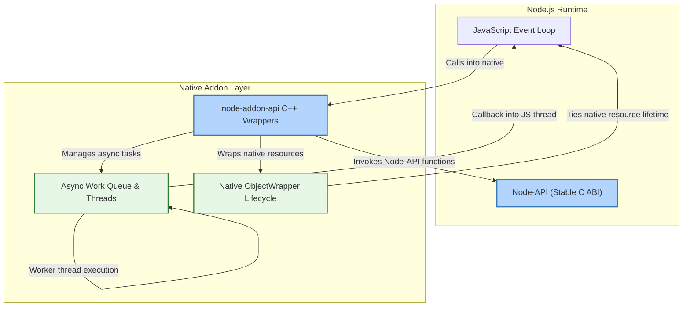

# Scalability and Performance Considerations

Enhancing the scalability and performance of your native Node.js addons is a critical factor in delivering high-throughput, low-latency applications. The `node-addon-api` library is engineered to provide a minimal overhead C++ abstraction on top of Node-API, ensuring native addons behave efficiently across diverse workloads and Node.js versions.

This guide dives into key considerations and best practices that help developers build scalable, performant addons without sacrificing stability or compatibility.

---

## Understanding Minimal Overhead Design

`node-addon-api` is designed as a thin C++ wrapper around the stable Node-API C interface. This layering achieves two core goals:

- **Low Performance Impact**: By minimizing abstraction layers and avoiding heavy runtime cost, it ensures native addons run with near-native speed.
- **ABI Stability**: The stable ABI interface handled by Node-API allows addons built with node-addon-api to maintain compatibility across Node.js releases without recompilation.

The benefits for scalability are clear: addons can be deployed in high-concurrency environments and scale seamlessly with Node.js upgrades.

### Practical Impact
- Wrapper methods directly invoke Node-API calls without expensive context switching.
- C++ exceptions add only marginal overhead while greatly improving error management.
- Memory and resource lifetimes are managed to avoid leaks under heavy load.

<Tip>
Keeping abstraction layers minimal is vital to preventing performance bottlenecks, especially in CPU-bound or high request-rate scenarios.
</Tip>

---

## Effective Resource Management at Scale

Performance and scalability hinge on careful control of resource lifecycle, especially in a native environment where memory management is manual or semi-automatic.

### Strategies Employed by node-addon-api

- **Handle Scopes and Persistent References**: These control memory usage of JavaScript objects from native C++ by specifying lifetimes explicitly, reducing GC pressure.
- **Native Object Lifetimes with `Napi::ObjectWrap`**: Associates native resources directly with JS object lifetimes.
- **Finalizers and Cleanup Hooks**: Release native resources deterministically during garbage collection and environment tears down.

Using these mechanisms properly ensures native memory does not leak and pressure on Node.js garbage collector stays low, allowing your addon to scale smoothly.

<Warning>
Avoid retaining persistent references longer than necessary, as this can lead to memory leaks and degraded performance under load.
</Warning>

### Recommendations

- Use **`Napi::ObjectWrap`** for complex native resources tied to JS objects.
- Implement finalizer callbacks to release heavy native allocations immediately when objects are GC’ed.
- Minimize global or static references that persist for the entire lifetime of the Node.js process unless absolutely needed.

---

## Handling Concurrent Workloads

High-performance addons must handle concurrent tasks efficiently without blocking the Node.js event loop.

### Async Worker Support

`node-addon-api` provides wrapped interfaces for asynchronous operations:

- **`Napi::AsyncWorker` and Derivatives**: Encapsulate native async work on worker threads, reporting results or progress back to JS without blocking.

Example flow:

1. Schedule background native computation.
2. Worker thread executes without blocking main loop.
3. Results delivered asynchronously with callback or promise.

This design allows addons to scale to thousands of concurrent async tasks without degrading responsiveness.

### Thread Safety and Callbacks

- Thread safety is preserved by ensuring that JavaScript callbacks are invoked only on the main thread.
- Async workers manage this synchronization transparently, minimizing developer burden.

<Tip>
Prefer async workers for any non-trivial native computation or IO to maintain smooth event loop behavior under scale.
</Tip>

---

## Scalability Across Node.js Versions and ABI Compatibility

Maintaining performance and compatibility as Node.js evolves is essential to long-term addon scalability.

### ABI Stability via Node-API

`node-addon-api` leverages Node-API’s stable ABI mechanism, shielding native addons from underlying changes in Node.js or V8 engines.

- Addons built with this API do not require rebuilding across minor or patch Node.js upgrades.
- This capability reduces operational overhead in deploying scalable distributed applications.

### Version Targeting and Feature Detection

Developers can specify Node-API versions and conditionally enable features based on runtime capabilities, ensuring addons run optimally on multiple versions:

- Use build flags with `binding.gyp` or CMake configuration to target Node-API version.
- Employ API feature detection to gracefully fallback older APIs when needed.

<Note>
Check the [Versioning and Node Compatibility](https://nodejs.org/api/n-api.html#versioning) guide for detailed instructions on handling version targets successfully.
</Note>

---

## Performance Optimization Best Practices

Achieving peak performance requires attention to both code design and build configuration.

### Exception Handling Impacts

- Using C++ exceptions via node-addon-api improves error propagation clarity.
- Exception support may incur slight runtime costs; consider disabling only if performance profiling indicates it.

### Build Variants and Compiler Flags

- Build with `.gyp` or CMake definitions to toggle exceptions, debug symbols, and optimization levels.
- Prefer Release builds with optimized flags for production use.

### Benchmarking and Profiling

- Utilize the provided benchmark scripts in the `benchmark/` directory to measure function call overhead.
- Profile memory usage and CPU hotspots to identify bottlenecks.

<Tip>
Regularly benchmark critical paths; rely on empirical data rather than assumptions for optimization decisions.
</Tip>

---

## Summary Workflow: Building for Scale and Performance

<Steps>
<Step title="Setup Your Build for ABI Stability">
Configure your build environment to target the right Node-API version with ABI compatibility and exception handling settings.
</Step>
<Step title="Manage Native Resources Carefully">
Use `Napi::ObjectWrap`, handle scopes, and finalizers to tie native lifecycles to JS objects and avoid leaks.
</Step>
<Step title="Implement Async Workers for Heavy Tasks">
Avoid blocking the event loop by delegating expensive operations to async workers.
</Step>
<Step title="Test and Benchmark Regularly">
Use benchmarking tools and test suites to validate performance and track regressions.
</Step>
<Step title="Maintain Cross-Version Compatibility">
Leverage Node-API’s stable ABI model and feature detection to keep addons scalable across Node.js releases.
</Step>
</Steps>

---

## Troubleshooting Performance Issues

<AccordionGroup title="Common Performance Pitfalls and Solutions">
<Accordion title="Memory Leaks Due to Persistent References">
Ensure that persistent references are released promptly. Use finalizers in `ObjectWrap` to clean up.
</Accordion>
<Accordion title="Blocking Calls in Main Thread">
Check that long-running native calls are performed asynchronously using AsyncWorker to prevent blocking.
</Accordion>
<Accordion title="Exception Handling Overhead">
If performance profiling identifies exception overhead, consider building a noexcept variant for hot code paths.
</Accordion>
<Accordion title="Version Compatibility Breaks">
Confirm that your ABI/API version targets are set correctly and test your addon against multiple Node.js versions.
</Accordion>
<Accordion title="Build Configuration Issues">
Validate your binding.gyp or CMakeLists.txt to ensure all flags and dependencies are correctly configured for performance.
</Accordion>
</AccordionGroup>

---

## Diagram: Simplified Flow of Native Addon Execution Under Node.js

---

By understanding and applying the core scalability and performance principles native to `node-addon-api`, you ensure that your addons can sustain demanding workloads and evolve gracefully alongside Node.js itself.

For hands-on guidance, consult the setup, troubleshooting, and API reference documentation to complement your development experience.

---