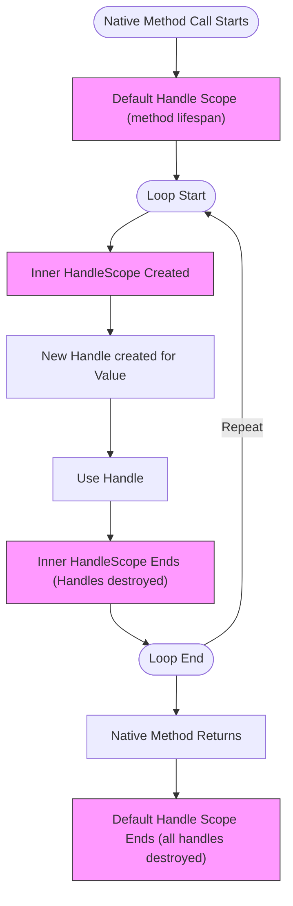

# Memory and Object Lifetime Management

Understanding how node-addon-api manages the lifetime of C++ objects and their JavaScript counterparts is essential for writing efficient and reliable native addons. This guide explains how handles and scopes control object lifetimes across the native and JavaScript boundaries, how to adjust handle scopes to optimize memory usage, and how to perform explicit resource cleanup with finalizers.

---

## Why Object Lifetime Management Matters

When building native addons with node-addon-api, managing object lifetimes is critical because JavaScript objects are subject to garbage collection, while native C++ objects must be explicitly tracked and released. Mishandling this can cause memory leaks if objects are held alive unnecessarily, or crashes if objects are prematurely collected.

Native code creates _handles_ to refer to JavaScript values internally. These handles keep the underlying JavaScript objects alive within the V8 heap, ensuring that the garbage collector is aware of native references. Effectively managing these handles and their lifetimes directly impacts native-addon performance and memory footprint.

---

## Handles and Scopes: The Foundation of Object Lifetimes

### What Is a Handle?

A handle is a reference wrapper created whenever a new `node-addon-api` `Value` or any of its subclasses is instantiated or returned. It acts as a bridge, keeping the associated JavaScript object "live" and preventing garbage collection as long as native code holds the handle.

All handles exist within a _scope_, which defines how long the handles remain valid and the JavaScript objects stay alive.

### Default Scope and Lifespan

By default, handles are tied to the lifespan of a native method call scope. This means all objects referenced by handles created during the native method remain alive until the method returns. This default behavior ensures objects aren't collected while native code is still using them.

---

## Adjusting Handle Lifetimes with Handle Scopes

Sometimes, the default scope tied to the entire native method call is either too long or too short for your needs. node-addon-api provides scoped classes to explicitly adjust handle lifetimes:

- `Napi::HandleScope`: Defines a new inner scope. Any handles created in this scope will be destroyed when the scope ends, allowing early cleanup.
- `Napi::EscapableHandleScope`: A special kind of scope that allows you to "escape" one handle, promoting its lifetime to the outer scope.

### Making Handle Lifetimes Shorter

Imagine a native method performing many iterations, creating a new `Napi::Value` each time—if all these values stay alive throughout the method’s lifecycle, memory pressure will grow unnecessarily.

#### Naive loop example (high memory usage):

```cpp
for (int i = 0; i < LOOP_MAX; i++) {
  std::string name = std::string("inner-scope") + std::to_string(i);
  Napi::Value newValue = Napi::String::New(info.Env(), name.c_str());
  // do something with newValue
};
```

Here, every `newValue` is kept alive for the entire method, inflating handle count and memory.

#### Optimized loop with `Napi::HandleScope`:

```cpp
for (int i = 0; i < LOOP_MAX; i++) {
  Napi::HandleScope scope(info.Env());
  std::string name = std::string("inner-scope") + std::to_string(i);
  Napi::Value newValue = Napi::String::New(info.Env(), name.c_str());
  // do something with newValue
};
```

By creating a new `HandleScope` inside the loop, each handle's lifetime is limited to a single iteration, freeing memory immediately after use.

### Escaping Handles to Extend Lifetime

When nested scopes are used, sometimes you want to keep a handle alive beyond a scope, for example to return a value created in an inner scope to the caller.

This is done by using a `Napi::EscapableHandleScope` and its `Escape` method to promote a handle from the inner scope to the outer one.

Example usage:

```cpp
Napi::EscapableHandleScope scope(info.Env());
Napi::Value innerValue = Napi::String::New(info.Env(), "keepAlive");
// Escape the handle to promote its lifetime
Napi::Value escapedValue = scope.Escape(innerValue);
return escapedValue;
```

> **Note:** `Escape` can only be called once per `EscapableHandleScope` instance.

---

## Explicit Resource Cleanup with Finalizers

While scopes control handle lifetime, they don't automatically clean up native resources. For native memory or handles bound to C++ objects, _finalizers_ are a critical mechanism for cleanup when garbage collection occurs.

### What Are Finalizers?

A finalizer is a native callback executed when a JavaScript object is garbage collected. It allows native code to free resources like memory or file handles safely once the object is no longer reachable.

### Basic vs. Full Finalizers

- **Basic finalizers** run during the garbage collection cycle and cannot access the JavaScript heap, enabling efficient cleanup but with limited API access.
- **Full finalizers** run post-garbage collection and can interact with the JavaScript environment but may be less performant.

### Example: Setting a Finalizer on an External Object

```cpp
Napi::External<int>::New(Env(), new int(1), [](Napi::Env env, int* data) {
  env.RunScript("console.log('Finalizer called')");
  delete data;
});
```

This example attaches a finalizer to a native pointer which logs when the finalizer runs and frees the allocated memory.

### Using Basic Finalizers for More Efficient Cleanup

Basic finalizers avoid accessing the JavaScript heap during GC, which allows them to execute promptly and reduce resource pressure.

Example:

```cpp
Napi::ArrayBuffer::New(
    Env(), data, length, [](Napi::BasicEnv /*env*/, void* finalizeData) {
      delete[] static_cast<uint8_t*>(finalizeData);
    });
```

Native memory tied to an `ArrayBuffer` is freed immediately during GC without interacting with JavaScript heap.

### Scheduling Additional Finalizers

If non-GC work is needed after memory frees, `Napi::BasicEnv::PostFinalizer()` can schedule a callback outside of GC. This enables running JavaScript code after native cleanup.

---

## Best Practices for Lifetime and Memory Management

- **Use handle scopes frequently in loops or intensive native operations** to limit memory growth.
- **Employ `EscapableHandleScope` when you need to pass values from inner to outer scopes.**
- **Always pair scope creation and destruction carefully.** Scopes must be released in reverse order.
- **Use finalizers to clean native resources bound to JavaScript objects.** Prefer basic finalizers when possible for efficiency.
- **Ensure all scopes created within a native method are destroyed before the method returns** to avoid leaked handles.

---

## Troubleshooting Common Issues

<AccordionGroup title="Common Pitfalls and How to Resolve Them">
<Accordion title="Memory Leakage Symptoms">
If your addon gradually consumes more memory, investigate handle scopes. Handles held too long by broad scopes cause memory bloat. Adding inner `HandleScope` instances in intensive loops helps constrain memory.
</Accordion>
<Accordion title="Premature Object Collection">
If objects you expect to be alive are collected early, check that handles remain valid in the scope duration. Use `EscapableHandleScope` to extend an object's lifetime beyond an inner scope.
</Accordion>
<Accordion title="Finalizers Not Running as Expected">
Ensure your finalizers conform to API limitations, especially with basic finalizers which cannot access the JavaScript heap. For callbacks needing heap access, schedule secondary callbacks post-finalization.
</Accordion>
</AccordionGroup>

---

## Summary

This page covered the critical concepts of object lifetime management in node-addon-api:

- How handles keep JavaScript objects alive for native C++ code
- The role of scopes (`HandleScope`, `EscapableHandleScope`) in controlling handle lifetimes
- Mechanisms to shorten or extend lifetimes using scopes and escaping handles
- Using finalizers for explicit native resource cleanup tied to garbage collection
- Best practices to avoid memory leaks and premature collection

Mastering these concepts enables you to write high-performance, memory-efficient native addons that safely interact with the JavaScript environment.

---

## Additional Resources

- [Node-addon-api Object Lifetime Management API Reference](./object_lifetime_management.md)
- [Finalization and Native Resource Cleanup](./finalization.md)
- [Error Handling and Exception Propagation](../concepts/architecture-overview/exception-handling.md)
- [Setup and Build Integration](../api-reference/integration-build/setup-build.md)

---

## Visual Overview of Handle Scopes and Lifetimes



This flowchart shows how handles are created inside nested scopes during a native method, with inner scopes limiting the lifetime of handles in iterations, preventing memory accumulation.

---