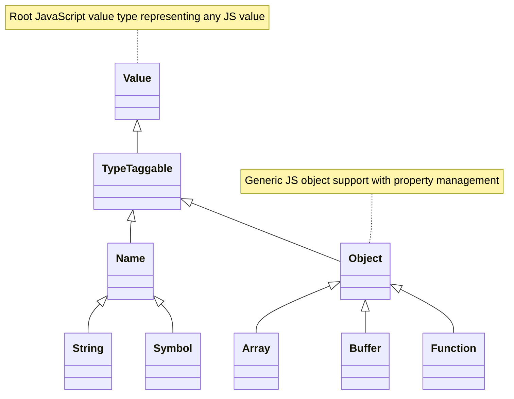

# The C++ Object Model

Explore how **node-addon-api** models JavaScript concepts in C++ classes — translating JavaScript primitives, objects, and functions into type-safe, idiomatic C++ abstractions. This empowers native addon developers with a natural programming experience while preserving JavaScript behavior and interoperability.

---

## Introduction

At its core, **node-addon-api** presents a rich C++ object model that encapsulates JavaScript values as native C++ classes. This design abstracts the Node-API C interface behind expressive, type-safe wrapper classes representing everything from generic values to specialized object types like arrays and functions.

Rather than treating JavaScript values as opaque handles, this object model provides intuitive C++ semantics, seamless conversions, and inheritance structures aligned with JavaScript types. By doing so, native addon authors gain precision and clarity in code, improved maintainability, and access to helpful type-specific methods while ensuring compatibility with the underlying JavaScript runtime.

---

## Core Principles of the C++ Object Model

### 1. JavaScript Values as `Napi::Value`

At the root of the model lies the class `Napi::Value`, which represents a JavaScript value of any type. It serves as a polymorphic container, allowing runtime queries to determine the actual underlying JavaScript type — such as string, number, object, boolean, etc.

```cpp
Napi::Value anyValue = ...;
if (anyValue.IsString()) {
    Napi::String str = anyValue.As<Napi::String>();
    // Use str-specific methods
}
```

*Key features of `Napi::Value` include:*
- Safe querying of JavaScript type via methods like `IsString()`, `IsObject()`, `IsFunction()`, etc.
- Casting to specific subclasses via `As<T>()` without runtime coercion.
- Creation helpers allowing conversion from C++ primitives `From(env, value)`.

### 2. Specialized Subclasses Represent JavaScript Primitives and Objects

`Napi::Value` branches into multiple subclasses, each mapping to fundamental JavaScript types, offering methods tailored for their semantics:

| C++ Class            | JavaScript Equivalent  |
| -------------------- | ---------------------- |
| `Napi::Boolean`      | Boolean literals       |
| `Napi::Number`       | Number literals        |
| `Napi::String`       | String literals        |
| `Napi::Symbol`       | Symbol values          |
| `Napi::BigInt`       | BigInt literals (≥v8)  |
| `Napi::Object`       | Objects                |
| `Napi::Array`        | Arrays                 |
| `Napi::Function`     | Functions              |
| `Napi::Buffer<T>`    | Node.js Buffers         |
| `Napi::ArrayBuffer`  | ArrayBuffers           |
| `Napi::TypedArray`   | Typed arrays           |

Each subclass inherits from classes higher in the hierarchy allowing polymorphism and shared behavior (e.g., `Napi::Array` inherits from `Napi::Object`).

### 3. `Napi::Object` as the Gateway to JavaScript Objects

The `Napi::Object` class corresponds to generic JavaScript objects. It empowers addon developers to:

- Set and get properties with flexible key types (strings, symbols, numbers).
- Check for property existence and ownership.
- Define properties with descriptors (accessors, functions, values).
- Enumerate keys and iterate over properties.
- Attach finalizers that run when the JS object is garbage collected.

Example:

```cpp
Napi::Env env = info.Env();
Napi::Object obj = Napi::Object::New(env);

// Set properties
obj.Set("name", "node-addon-api");
obj.Set(42u, 12345);  // Using uint32_t as key

// Get properties
auto name = obj.Get("name").As<Napi::String>();

// Check for property
if(obj.Has("name")) {
    // ...
}
```

### 4. Enabling Convenient Property Access via Operator Overloads

`Napi::Object` overloads `operator[]` for intuitive property access resembling JavaScript bracket notation. This returns a mutable `PropertyLValue` helper permitting both reads and writes:

```cpp
obj["prop"] = Napi::Boolean::New(env, true);
bool exists = obj.Has("prop");
```

This abstraction facilitates writing expressive, natural C++ code while handling JavaScript property semantics safely.

### 5. Type Safety and Runtime Checks

All casts via `As<T>()` are unchecked by default but can optionally include type validation when compiled with certain safeguards enabled.

Most operations validate inputs ahead and throw exceptions (when exceptions are enabled) or raise pending JavaScript errors (otherwise) to maintain consistency with JavaScript semantics.

---

## Class Hierarchy and Inheritance Structure

The classes form a hierarchy reflecting JavaScript types and behaviors, offering inheritance-based polymorphism:



- `Napi::Value` is the abstract root.
- `Napi::TypeTaggable` adds advanced capabilities for associating type tags to objects (when supported).
- `Napi::Name` is a base class for property names—strings and symbols.
- `Napi::Object` represents broad JavaScript objects with derived specializations.

---

## Native Object Wrappers and Lifetime Management

Classes derived from `Napi::ObjectWrap<T>` or `Napi::InstanceWrap<T>` enable binding C++ class instances to JavaScript objects, handling lifetime synchronization between realms.

- When a JS object is created, a corresponding wrapped C++ object is instantiated.
- Method calls on JS objects directly invoke wrapped C++ methods.
- When the JS object is garbage collected, the native C++ destructor eventually runs.

This powerful pattern lets developers expose native objects naturally while managing resource cleanup automatically.

---

## Working with Functions

The `Napi::Function` class models JavaScript functions. It allows:

- Creating JavaScript functions from native callbacks.
- Calling functions with argument lists and receiving return values.
- Constructing new objects using the function as a constructor.

Example creating and calling a simple function:

```cpp
Napi::Function fn = Napi::Function::New(env, [](const CallbackInfo& info) {
    return Napi::Number::New(info.Env(), 42);
});

Napi::Value result = fn.Call({});
int32_t answer = result.As<Napi::Number>();
```

---

## Benefits of the C++ Object Model

### 1. Intuitive Mapping of JavaScript Concepts

The model ensures developers can reason about JavaScript values naturally in C++ without wrestling with low-level API intricacies, making code clearer and less error-prone.

### 2. Strong Type Safety

By exposing specific C++ subclasses with type-specific methods and safe casts, the model reduces bugs by preventing invalid type manipulations.

### 3. Seamless Interoperability

The classes interoperate cleanly with Node-API’s ABI stable interface, ensuring addons built atop this model remain cross-version compatible.

### 4. Code Reusability and Extensibility

The inheritance structure enables extending classes and reusing code for both primitive and advanced JavaScript object types.

### 5. Automatic Resource and Lifetime Control

Object wrapping and finalizers simplify memory management and lifecycle synchronization between JS and native code.

---

## Practical Example: Creating a Native Wrapped Object

```cpp
#include <napi.h>

class Counter : public Napi::ObjectWrap<Counter> {
public:
  static Napi::Function DefineClass(Napi::Env env) {
    return Napi::ObjectWrap<Counter>::DefineClass(env, "Counter", {
      InstanceMethod("increment", &Counter::Increment)
    });
  }

  Counter(const Napi::CallbackInfo& info) : Napi::ObjectWrap<Counter>(info) {
    _count = (info.Length() > 0 && info[0].IsNumber())
                 ? info[0].As<Napi::Number>().Int32Value()
                 : 0;
  }

  Napi::Value Increment(const Napi::CallbackInfo& info) {
    _count += 1;
    return Napi::Number::New(info.Env(), _count);
  }

private:
  int32_t _count;
};

Napi::Object Init(Napi::Env env, Napi::Object exports) {
  exports.Set("Counter", Counter::DefineClass(env));
  return exports;
}

NODE_API_MODULE(NODE_GYP_MODULE_NAME, Init)
```

This example demonstrates how the C++ object model makes it straightforward to expose stateful classes to JavaScript:

- Define the constructor and methods.
- Use `ObjectWrap` to tie native C++ state to JS object lifecycle.
- Export to Node.js with familiar interfaces.

---

## Troubleshooting Common Pitfalls

- **Type Mismatches:** Always use `.As<T>()` only after checking the type with `.IsT()` to avoid unexpected behavior.
- **Object Lifetime Issues:** Wrapped native objects’ destructors run upon garbage collection, which might be delayed. Do not rely on immediate destruction after JS object goes out of scope.
- **Exception Safety:** Enable C++ exceptions in builds for safer error handling; otherwise, check for pending exceptions after API calls.
- **Property Access Failures:** When defining or accessing properties, ensure keys are valid and property descriptors follow the API contract.

---

## Summary

The **node-addon-api C++ object model** elegantly bridges JavaScript runtime concepts to native C++ with expressive, type-safe, and well-structured classes. It empowers developers to write robust native addons with clarity, natural object manipulation, and managed lifecycles while maintaining full compatibility with Node.js internals.

By understanding this object model, developers unlock the full potential of native integration in Node.js, delivering high-performance, maintainable, and idiomatic C++ addons.

---

## See Also

- [node-addon-api Overview & Architecture](../overview/architecture-and-concepts/system-architecture.md)
- [Napi::Object Class Reference](../api-reference/core-cpp-api/object-management.md)
- [Object Wrap & Native Class Binding](../api-reference/core-cpp-api/object-wrap.md)
- [Type Mapping between JavaScript and C++](../concepts/integration-and-workflows/data-types-mapping.md)
- [Error Handling and Exception Propagation](../concepts/architecture-overview/exception-handling.md)

---