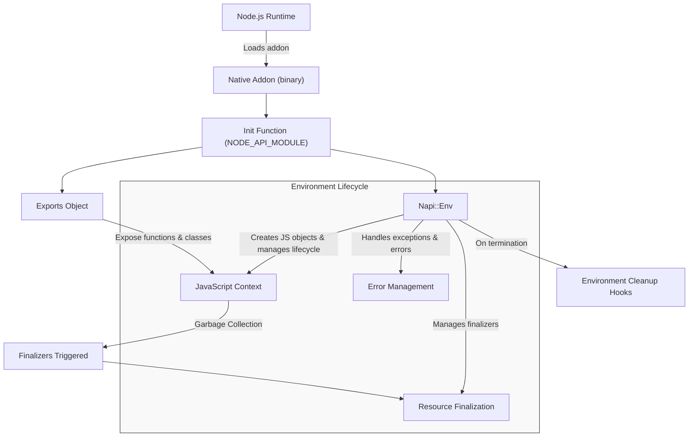

# Addon Initialization and Environment Management

Explore the fundamental principles behind how addons are loaded in Node.js using **node-addon-api**, how *Napi::Env* environments are created and managed, and how you can inject initialization logic or hook lifecycle events to seamlessly integrate native code with JavaScript.

---

## Understanding Addon Initialization

When building a Node.js native addon with **node-addon-api**, the very first step is the initialization of your addon module. Initialization is the gateway that allows your C++ code to interact with the JavaScript runtime environment.

### Life of an Addon Initialization

1. **Loading the native module:** When Node.js loads your native addon (e.g., `.node` binary), the runtime calls the initialization function registered with your addon.
2. **Native environment creation:** Node.js passes a `Napi::Env` instance representing the current runtime environment.
3. **Binding exports:** Your initialization function defines the JavaScript-visible objects, functions, and properties by setting keys on the `exports` object.
4. **Returning exports:** Finally, the exports object is returned and becomes available wherever your addon is `require()`d in JavaScript.

### How initialization function looks

Your native addon must expose an initialization function that matches the **Node-API** expectations, typically structured like this:

```cpp
#include <napi.h>

Napi::Object Init(Napi::Env env, Napi::Object exports) {
  // Define your addon properties and functions here
  exports.Set("myFunction", Napi::Function::New(env, MyFunction));

  return exports;
}

// Register the addon with a macro
NODE_API_MODULE(NODE_GYP_MODULE_NAME, Init)
```

The macro `NODE_API_MODULE` ensures Node.js knows the starting point for your addon initialization.

---

## The Role of the `Napi::Env` Environment

`Napi::Env` is your gateway to interacting with the JavaScript engine's runtime from within your C++ addon code. Each addon instance runs within an environment that encapsulates state, resources, and lifecycle information.

### Why `Napi::Env` Matters

- **Lifecycle Management:** It tracks when the environment is alive, terminating, or has exceptions pending.
- **Resource Attachment:** Native objects can be associated with the environment, ensuring garbage collection and cleanup happen appropriately.
- **Error Handling Context:** It manages exceptions and provides APIs to throw, clear, or query JavaScript errors.

### User Intent and Practical Example

Whether creating a new function, object, or buffer, `env` is essential:

```cpp
void MyFunction(const Napi::CallbackInfo& info) {
  Napi::Env env = info.Env();
  Napi::Number num = Napi::Number::New(env, 42);
  // Use `num` as returned value or internal logic
}
```

Here, the `env` ensures all objects are created properly in the right JavaScript context.

---

## Managing Environments and Lifecycle Hooks

### Addon Environment Lifecycle

An environment (`Napi::Env`) represents an active instance of the JavaScript engine where your addon operates. It is critical to understand:

- Environments are created when the addon loads.
- They can be shared or isolated, e.g., in worker threads or isolated V8 contexts.
- They will eventually terminate, triggering cleanup routines.

### Registering Initialization Logic

You implement your addon initialization by providing functions like `Init` and registering them with `NODE_API_MODULE`. This pattern ensures your logic executes **exactly once** when your addon loads.

### Injecting Lifecycle and Cleanup Hooks

Beyond initialization, **node-addon-api** allows you to hook into the addon lifecycle to perform cleanup or resource management, such as:

- **Finalizers:** Attach finalizer callbacks for native objects to free native resources when JavaScript objects are garbage collected.
- **Environment cleanup hooks:** Run callbacks just before the Node environment terminates, useful for global resource cleanup.

These hooks ensure your addon manages memory correctly and avoids leaks or crashes due to stale resources.

---

## Best Practices for Addon Initialization and Environment Management

- **Always return the `exports` object** after adding your native functions or objects.
- **Keep initialization lightweight.** Heavy computation or I/O should be deferred to later calls, not in the init.
- **Register cleanup hooks carefully** to avoid leaking native resources. Use `Napi::ObjectWrap` for wrapping native classes with automatic lifecycle management.
- **Handle exceptions during initialization** through proper error handling patterns as described in the error handling guides.
- **Use consistent `Napi::Env` instances** when creating or managing any JavaScript-visible object.

---

## Typical User Flow: Creating and Exporting a Native Function

<Steps>
<Step title="Define the native function">
Create your C++ function using the `Napi::CallbackInfo` and extract the environment.
</Step>
<Step title="Bind the function to exports">
Inside your initialization function, add your function to the exports object.
</Step>
<Step title="Register the initialization function">
Use the macro `NODE_API_MODULE` so Node.js recognizes your entry point when the addon loads.
</Step>
<Step title="Build and require in JavaScript">
Compile your addon with `node-gyp` or similar and load it with `require()` in your Node.js app.
</Step>
</Steps>

After this, your functionality is callable from JavaScript with the native performance.

---

## Troubleshooting and Common Pitfalls

<AccordionGroup title="Initialization Gotchas and Environment Management">
<Accordion title="Initialization function not called">
Ensure the function registered with `NODE_API_MODULE` is not namespaced and the target name in `binding.gyp` matches precisely.
</Accordion>
<Accordion title="Environment mismatch on object creation">
Always use the `Napi::Env` passed down in your callback or initialization function to create wrapped objects. Creating objects with mismatched environments can cause runtime errors.
</Accordion>
<Accordion title="Memory leaks in native objects">
Use `Napi::ObjectWrap` or manually define finalizer callbacks to release native resources when JavaScript objects are garbage collected.
</Accordion>
<Accordion title="Error during initialization prevents addon load">
Handle and catch exceptions in your initialization function. Unhandled exceptions will fail addon loading, causing Node.js to throw at require-time.
</Accordion>
</AccordionGroup>

---

## Diagram: Addon Initialization and Environment Lifecycle



This flow illustrates how Node.js loads the native addon, triggers initialization, provides an environment for execution, manages lifecycle, and handles cleanup.

---

## Further Reading and Related Documentation

- [Setup and Build System Integration](../api-reference/integration-build/setup-build) — How to configure your build environment to use node-addon-api properly.
- [Error Handling and Exception Propagation](../api-reference/error-handling-lifecycle/error-exceptions) — Best practices for managing errors during initialization and runtime.
- [Environment and Resource Management](../api-reference/error-handling-lifecycle/env-management) — Deep dive into environment lifecycle hooks and memory management.
- [Creating Your First Addon](../guides/getting-started/create-your-first-addon) — Step-by-step guide for beginners.

<Tip>
To maintain stability and avoid subtle bugs, always ensure your addon initialization code is simple, well-structured, and handles exceptions gracefully while leveraging `Napi::Env` effectively.
</Tip>
