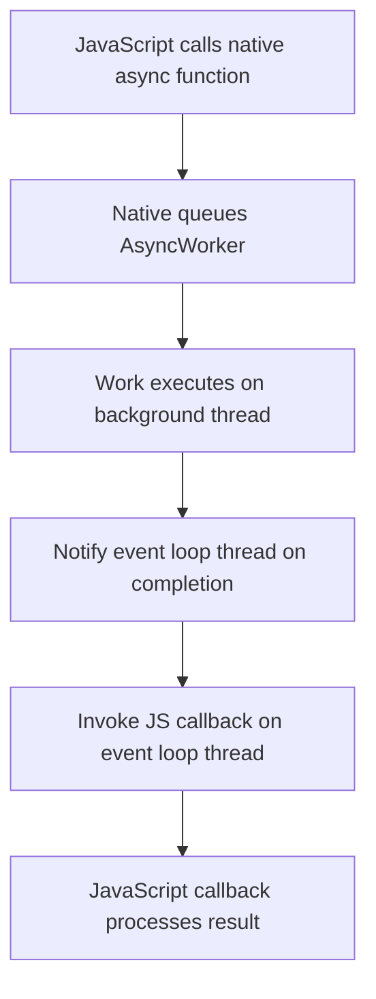

# Asynchronous Operations in node-addon-api

Node.js native addons often need to perform operations that take significant time, such as file I/O, network requests, or heavy computations. To keep your application responsive, these tasks **must not block the Node.js event loop**. Instead, they should be executed asynchronously, allowing JavaScript to continue processing other events while native work completes in parallel.

This guide explains how **node-addon-api** supports asynchronous workloads, focusing on key concepts, patterns, and practical usage of async workers and thread-safe functions to build responsive, non-blocking native addons.

---

## Understanding the Need for Asynchronous Operations

### The Node.js Event Loop

- The event loop runs JavaScript code on a single thread.
- Blocking this thread delays all other JavaScript execution.
- Long-running native operations must be offloaded to worker threads.

### Offloading Work with libuv

Node.js uses the **libuv** thread pool to execute asynchronous work in the background.

- Native addons can schedule work on libuv threads.
- Work completes asynchronously, notifying the event loop when done.

---

## Key Async Patterns in node-addon-api

### Napi::AsyncWorker

`Napi::AsyncWorker` is an abstract C++ class designed to simplify asynchronous work implementations:

- Encapsulates the details of offloading work to threads.
- Provides hooks to perform the background task and then notify JavaScript when complete.
- Handles thread-safe communication back to the event loop.

This class fits scenarios where native work is queued and results are sent back once finished, avoiding event loop blocking.

### AsyncProgressWorker and AsyncProgressQueueWorker

These are specialized extensions of `AsyncWorker` that additionally support progress reporting:

- `AsyncProgressWorker` lets native code report progress updates to JavaScript callbacks.
- `AsyncProgressQueueWorker` manages queued progress updates more efficiently.

### AsyncContext and CallbackScope

When using other asynchronous mechanisms, or custom async workflows not directly based on `AsyncWorker`, node-addon-api offers:

- **AsyncContext**: Manages async execution context ensuring proper async tracking.
- **CallbackScope**: Ensures that callbacks execute with the correct async environment.

These APIs help native addons maintain execution context correctness and influence async_hooks properly.

---

## Practical Workflow: Using Async Workers

### 1. Define a Worker Class

Inherit from `Napi::AsyncWorker` and override the key methods:

- `Execute()`: Code that runs on the worker thread.
- `OnOK()`: Called on the main thread to deliver success results.
- `OnError()`: Called on the main thread if an error occurs.

Example:

```cpp
class MyAsyncWorker : public Napi::AsyncWorker {
public:
  MyAsyncWorker(Napi::Function& callback) : Napi::AsyncWorker(callback) {}

  void Execute() override {
    // Perform long running task here
    // Set error message if needed
  }

  void OnOK() override {
    // Callback to JS when finished successfully
  }

  void OnError(const Napi::Error& e) override {
    // Handle error and invoke callback
  }
};
```

### 2. Queue the Worker

Create an instance and queue it to run asynchronously:

```cpp
void StartAsyncWork(const Napi::CallbackInfo& info) {
  Napi::Function callback = info[0].As<Napi::Function>();
  MyAsyncWorker* worker = new MyAsyncWorker(callback);
  worker->Queue();
}
```

### 3. Receive Result in JavaScript

The callback provided is invoked upon completion or error, allowing JavaScript to respond.

---

## Thread-Safe Functions: Safe Cross-Thread Calls

For scenarios needing frequent or concurrent calls from native threads back to JavaScript, **threadsafe functions** provide:

- Safe invocation of JavaScript callbacks from non-main threads.
- Avoid race conditions and corrupt state.
- Control over blocking or non-blocking call modes.

Common use cases include messaging, event notifications, or streaming data.

Refer to [Threadsafe Functions and Safe Cross-Thread Calls](/api-reference/async-and-threading/threadsafe-functions) for implementation details.

---

## Insights from Test Suites and Async Hooks

The node-addon-api test suites demonstrate the use of async workers and queue workers with detailed checks using `async_hooks`. These tests:

- Validate asynchronous lifecycle events like `init`, `before`, `after`, and `destroy`.
- Ensure that native async resources are tracked properly.
- Show practical callback overloads supporting context and resource passing.

This highlights the importance of **integrating with Node.js async hooks** for diagnostics and debugging.

---

## Best Practices & Tips

- Always offload long-running or blocking native operations using `AsyncWorker` or similar patterns.
- Use progress reporting workers (`AsyncProgressWorker`) when feedback during operation is required.
- Employ thread-safe functions when calling back to JavaScript frequently or from multiple threads.
- Manage async context carefully by leveraging AsyncContext and CallbackScope APIs where applicable.
- Test your asynchronous code thoroughly, preferably with async hooks enabled to verify lifecycle correctness.

---

## Common Pitfalls to Avoid

- Blocking the JavaScript event loop by performing heavy work on the main thread.
- Forgetting to queue async workers or failing to invoke appropriate callbacks.
- Neglecting proper environment management leading to memory leaks or crashes.
- Ignoring async hooks integration, making debugging difficult.

---

## Summary Diagram: Async Worker Workflow



---

## Further Reading and Resources

- [Async Workers and Execution Models](/api-reference/async-and-threading/async-workers)
- [Promises and Asynchronous Patterns](/api-reference/async-and-threading/promises-async)
- [Threadsafe Functions and Safe Cross-Thread Calls](/api-reference/async-and-threading/threadsafe-functions)
- [Async Context and Callback Scope](/concepts/integration-and-workflows/async-programming)

Explore also the [Node.js official docs on async programming](https://nodejs.org/en/docs/guides/blocking-vs-non-blocking/) for a broader understanding.

---

By mastering these asynchronous patterns in node-addon-api, you can build robust, high-performance native addons that fully align with Node.js’s non-blocking design, ensuring excellent application responsiveness and scalability.
