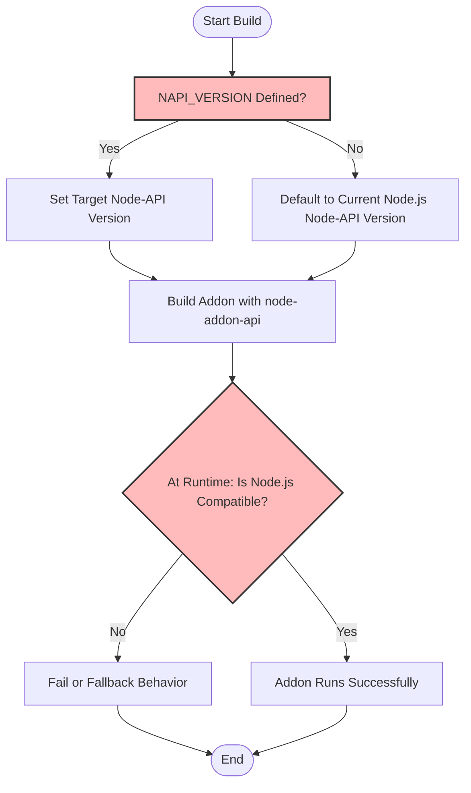

# Versioning and Node Compatibility

Understanding how versioning works and ensuring your native addon remains compatible across Node.js releases are crucial for maintaining stability and reach. This guide demystifies version targeting, Node-API feature detection, and compatibility responsibilities, empowering you to support a broad range of Node.js versions effectively.

---

## Why Versioning Matters

Node.js evolves continually, introducing new API versions and deprecating older ones. node-addon-api leverages Node-API, a stable ABI designed to insulate addons from such changes. Ensuring the right Node-API version targeting helps your addon:

- Run across multiple Node.js versions without recompilation
- Use the latest features safely
- Maintain ABI stability and reduce maintenance overhead

Without careful versioning, addons risk breaking or incompatibility issues in different environments.

---

## Key Concepts

### 1. Node-API Version Targeting

Node-API specifies a versioned C ABI that Node.js guarantees stability for. Your addon builds against a specific Node-API version and can safely run on any Node.js release supporting that version or higher.

- **Specifying the version:** Through your build configuration (`binding.gyp` or equivalent), you declare the `NAPI_VERSION` your addon targets.
- **Build-time resolution:** The build system uses this range to choose whether to link with the built-in Node-API or fall back to the node-addon-api compatibility layer.
- **Runtime capability:** At runtime, the version detected by Node.js dictates which API functions are available.

### 2. Feature Detection and Backwards Compatibility

Node-API evolves by adding functions and behaviors without breaking existing APIs. When your addon uses features from a newer Node-API version, it's important:

- To detect feature availability programmatically if your addon runs on multiple Node.js versions.
- To gracefully degrade or avoid using newer features if unsupported.

### 3. Compatibility Responsibilities

As an addon author, you are responsible for:

- Declaring the minimum Node-API version your addon needs.
- Ensuring your build environment supports that version.
- Testing your addon against all Node.js versions within your compatibility range.
- Using tools and prebuilds to ease installation across Node.js versions and platforms.

---

## Practical Version Targeting

### Configuring `binding.gyp`

Within your `binding.gyp`, you specify which node-addon-api target to depend on, based on exception support and Node-API versioning strategy:

```gyp
{
  'dependencies': [
    "<!(node -p \"require('node-addon-api').targets\")"
  ],
  'defines': ['NAPI_VERSION=4'],  # Target Node-API version, e.g., 4
}
```

This example targets Node-API version 4, widely supported in active LTS Node.js versions.

### Choosing Exception Support Variants

`node-addon-api` provides variants to enable C++ exception handling:

- **Without C++ exceptions:** `node_addon_api` target
- **With limited C++ exceptions (`Napi::Error` only):** `node_addon_api_except`
- **With full C++ exceptions:** `node_addon_api_except_all`

Ensure your build configuration matches your exception handling choice to maintain ABI compatibility.

---

## Supporting Multiple Node.js Versions

### Strategy

1. **Set the minimum NAPI_VERSION:** To the lowest Node-API version you want to support.
2. **Runtime checks:** Detect the availability of newer features when running on newer Node.js versions.
3. **Use prebuilds:** To avoid compile-time issues on user machines and speed up installation.

### Available Prebuild Tools

Leverage community tools to distribute your addon in ready-to-use binary form:

- [node-pre-gyp](https://www.npmjs.com/package/node-pre-gyp)
- [prebuild](https://www.npmjs.com/package/prebuild)
- [prebuildify](https://www.npmjs.com/package/prebuildify)

These tools integrate well with Node-API and simplify cross-version support.

---

## Best Practices

<AccordionGroup title="Versioning Best Practices and Pitfalls">
<Accordion title="Declare Explicit Minimum Node-API Version">
Always specify the minimum Node-API version you require in your build files. This removes ambiguity and prevents inadvertent compatibility breaks.
</Accordion>
<Accordion title="Test Across Node.js Versions">
Test your addon across the Node.js versions that correspond to your targeted Node-API versions. This ensures behavior is consistent and prevents regressions.
</Accordion>
<Accordion title="Use Safe Feature Detection">
Instead of assuming availability, detect whether advanced Node-API features exist to avoid runtime failures.
</Accordion>
<Accordion title="Avoid Including Non-ABI-Stable Headers">
Only include Node-API headers (`napi.h`) and avoid internal Node.js or V8 headers to maintain ABI stability.
</Accordion>
<Accordion title="Leverage Prebuilds to Enhance UX">
Distribute prebuilt binaries to reduce build errors and speed up installs on end users' machines.
</Accordion>
</AccordionGroup>

---

## Visualizing Versioning in Workflow



---

## Troubleshooting Version Issues

Common problems when working with versioning include:

- **Build failures due to missing or mismatched NAPI_VERSION:**
  Confirm `NAPI_VERSION` environment variable or `binding.gyp` definitions are correct.
- **Runtime errors in unsupported Node.js versions:**
  Verify the Node.js version supports the targeted Node-API version and that runtime compatibility checks are in place.
- **Unexpected fallback to node-addon-api compatibility layer:**
  Check your build target and Node.js version pairing.

See the [Setup and Build System Integration](https://github.com/nodejs/node-addon-api/blob/main/doc/setup.md) and [Troubleshooting Guide](https://github.com/nodejs/node-addon-api/blob/main/getting-started/troubleshooting/troubleshooting-guide.mdx) for detailed diagnostic workflows.

---

## Summary

By intentionally managing the Node-API version your addon targets, combined with practical feature detection and robust build configuration, you unlock cross-version compatibility with minimal rebuilds. Leveraging prebuilds and testing extensively ensures your addon reliably serves users on active LTS Node.js versions.

---

## Additional Resources

- [Node-API ABI Stability Guide](https://nodejs.org/en/docs/guides/abi-stability/)
- [Setup and Build Integration Documentation](https://github.com/nodejs/node-addon-api/blob/main/doc/setup.md)
- [Node-API Versioning and Compatibility (API Reference)](https://github.com/nodejs/node-addon-api/blob/main/api-reference/integration-build/api-versioning-support.mdx)
- [Prebuild Tools Overview](https://github.com/nodejs/node-addon-api/blob/main/doc/prebuild_tools.md)
- [Troubleshooting Setup Issues](https://github.com/nodejs/node-addon-api/blob/main/getting-started/troubleshooting/troubleshooting-guide.mdx)

---

## Related Documentation

This page complements the broader documentation structure:

- Explore the [System Architecture Overview](https://github.com/nodejs/node-addon-api/blob/main/overview/architecture-and-concepts/system-architecture.mdx) to understand overall integration with Node.js and build tools.
- Review the [Integration with Node.js and Build Tools](https://github.com/nodejs/node-addon-api/blob/main/overview/architecture-and-concepts/integration-points.mdx) for interoperability details.
- Consult [Setup and Build System Integration](https://github.com/nodejs/node-addon-api/blob/main/api-reference/integration-build/setup-build.mdx) for hands-on configuration.

---

## Callout
<Info>
Based on node-addon-api's policy, only active LTS Node.js versions are officially supported. The minimum supported Node.js version currently is 18.x. Plan your compatibility range accordingly.
</Info>

---

## Summary Table: Node-API Versions and Node.js Releases

| Node-API Version | Node.js Minimum Version (LTS) | Notes                         |
|------------------|-------------------------------|-------------------------------|
| 1                | Node.js 8 (deprecated)         | Legacy, no longer supported    |
| 3                | Node.js 10                    | Deprecated                    |
| 4                | Node.js 12                   | Active in earlier LTS          |
| 5                | Node.js 13                    | Current feature baseline       |
| 6 - 9            | Node.js 14 to 20+             | Latest supported Node-API versions |

(Client addons should consult this table to align their target Node-API version with desired Node.js platform support.)