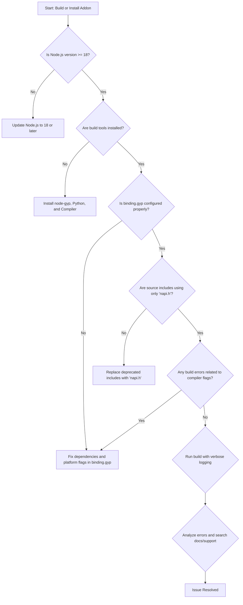

# Troubleshooting Setup Issues

This guide provides clear and actionable steps to diagnose and resolve common setup problems encountered when installing and using **node-addon-api**. Whether you face Node.js version mismatches, build errors, missing dependencies, or compiler configuration issues, this resource will help you identify the root cause and apply effective solutions. We also include references to specific error messages and decision trees to streamline your troubleshooting workflow.

---

## 1. Common Errors and Their Causes

### 1.1 Node.js Version Mismatch
- **Symptom**: Errors related to unsupported or incompatible Node.js versions during addon build or runtime.
- **Cause**: Your Node.js version does not support the targeted Node-API version of your addon.

**How to check:**

```bash
node -v
```

Verify your Node.js version against the supported versions in the [Node-API version matrix](https://nodejs.org/dist/latest/docs/api/n-api.html#node-api-version-matrix).

<Tip>
The current node-addon-api supports Node.js 18.x and later as the minimum. Using an older version will cause build or runtime failures.
</Tip>

---

### 1.2 Missing or Incorrect Build Tools
- **Symptom**: `node-gyp` errors complaining about missing compilers or Python.
- **Cause**: Required build dependencies such as Python, a C++ compiler toolchain, or node-gyp are missing or misconfigured.

**Verification and resolution:**

- Ensure **node-gyp** is installed globally or as a dev dependency:

```bash
npm install -g node-gyp
```

- On Windows, install the necessary [Windows Build Tools](https://github.com/felixrieseberg/windows-build-tools). 
- On macOS and Linux, verify you have a C++ compiler and Python 2.7 or 3.x installed and accessible.

<Tip>
Use official Node.js setup guides or platform-specific instructions to install build environments with all dependencies.
</Tip>

---

### 1.3 Compiler Flag and Binding Configuration Issues
- **Symptom**: Build failures with errors about flags, macros, or `binding.gyp` misconfiguration.
- **Cause**: Incorrect or missing compiler flags in `binding.gyp` related to Node-API usage or platform specifics.

**Common problem areas:**

- Missing the correct dependency on `node-addon-api` targets, such as `node_addon_api_except` for C++ exceptions.
- Absence of platform-specific flags like `-fvisibility=hidden` on macOS.

**Resolution:**

Ensure your `binding.gyp` includes the required sections as described in the [Configuring Your Build Environment](https://your-docs/getting-started/setup-basics/configuring-build) guide.

Example snippet to enable exceptions and platform flags:

```gyp
'dependencies': [
  "<!(node -p 'require(\'node-addon-api\').targets'):node_addon_api_except",
],
'conditions': [
  ['OS=="mac"', {
    'cflags+': ['-fvisibility=hidden'],
    'xcode_settings': {
      'OTHER_CFLAGS': ['-fvisibility=hidden']
    }
  }]
]
```

---

### 1.4 Missing Node-API Headers or Incorrect Includes
- **Symptom**: Compilation errors such as `napi.h` not found or use of deprecated headers.
- **Cause**: Your source code includes incorrect Node.js internal headers or misses `node-addon-api` includes.

**Resolution:**

Make sure your C++ files include only the supported header:

```cpp
#include "napi.h"
```

Avoid including internal headers like `node.h`, `nan.h`, or `v8.h` to maintain ABI stability.

---

### 1.5 Dependency Version Conflict or NPM Cache Issues
- **Symptom**: Installation fails with errors referencing version conflicts or corrupted packages.
- **Cause**: NPM cache or package-lock file inconsistencies.

**Resolution:**

Clear your npm cache and reinstall:

```bash
npm cache clean --force
npm install
```

Also, review your `package.json` dependencies to align with the recommended versions.

---

## 2. Diagnostic Workflow

Follow this step-by-step flow to isolate your setup issue:

<Steps>
<Step title="Verify Node.js Version">
Run `node -v` and ensure your version is 18.x or later.
If outdated, update Node.js.
</Step>
<Step title="Check Build Tools Installation">
Verify node-gyp is installed and the presence of build tools (compiler, Python).
Refer to platform-specific setup guides if missing.
</Step>
<Step title="Validate binding.gyp Configuration">
Confirm correct dependencies on node-addon-api targets and platform flags.
Use official examples from the [Configuring Your Build Environment](https://your-docs/getting-started/setup-basics/configuring-build) page.
</Step>
<Step title="Review Source Code Includes">
Ensure only `napi.h` is included in C++ source files.
Avoid deprecated or internal Node.js headers.
</Step>
<Step title="Inspect NPM and Cache State">
Clean the npm cache and reinstall dependencies.
Check for version mismatches or dependency overrides.
</Step>
<Step title="Run Build Verbose Log">
Build with verbose logging:

```bash
node-gyp rebuild --verbose
```

Analyze error messages for detailed root cause clues.
</Step>
</Steps>

---

## 3. Detailed Examples of Fixes

### Example: Fixing Node.js Version Mismatch

If you see an error like:

```
Error: Unsupported Node.js version. Minimum supported is 18.x
```

Update Node.js:

```bash
# Using nvm (Node Version Manager)
nvm install 18
nvm use 18
```

Retest your addon build afterwards.


### Example: Adding C++ Exceptions Support

If your addon requires catching all C++ exceptions, modify `binding.gyp`:

```gyp
{
  'targets': [
    {
      'target_name': 'your-addon',
      'dependencies': [
        "<!(node -p 'require(\'node-addon-api\').targets'):node_addon_api_except_all",
      ],
      'sources': ['addon.cc'],
    }
  ]
}
```

This enables catching of exceptions derived from `std::exception` and others.

---

## 4. Troubleshooting Decision Tree



Use this flow to systematically resolve setup and build issues.

---

## 5. Additional Tips & Best Practices

- Always pin your `node-addon-api` version in `package.json` to avoid unexpected incompatibilities.
- Use version badges in your README to indicate minimum Node-API and Node.js versions supported.
- Regularly clean your build directories (`node-gyp clean`) to avoid stale or conflicting object files.
- Familiarize yourself with common `node-gyp` commands and their options for debugging.

---

## 6. Where to Get More Help

- **Official Documentation:** [node-addon-api docs](https://github.com/nodejs/node-addon-api/blob/main/doc/README.md)
- **node-gyp wiki:** https://github.com/nodejs/node-gyp/wiki
- **Github Issues:** For bugs or issues: https://github.com/nodejs/node-addon-api/issues
- **Community Forums:** StackOverflow, Node.js GitHub discussions

---

By following these structured steps, you'll efficiently resolve typical installation and setup hurdles and be on your way to creating robust native addons with node-addon-api.


---

## References

- [Node.js Versions and Node-API Support Matrix](https://nodejs.org/dist/latest/docs/api/n-api.html#node-api-version-matrix)
- [node-gyp Official Documentation](https://github.com/nodejs/node-gyp)
- [Configuring Your Build Environment Guide](/getting-started/setup-basics/configuring-build)
- [Error Handling Overview](/guides/advanced-best-practices/error-handling)

---