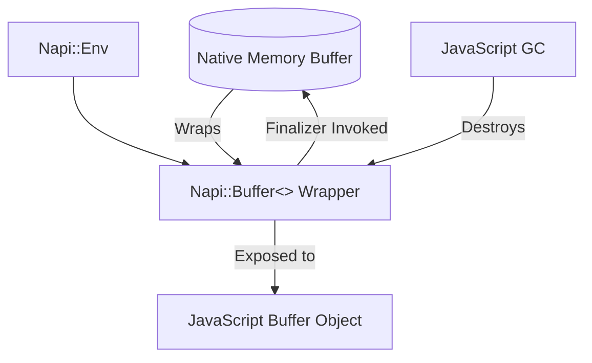

# Buffers and Typed Arrays: Efficient Data Exchange

Unlock efficient binary data handling with node-addon-api’s Buffer and TypedArray interfaces. This guide shows how to create, read, and write Buffers, TypedArrays, and ArrayBuffers for seamless native-JS integration.

---

## 1. Overview

### What This Guide Helps You Accomplish
This guide empowers C++ addon developers to handle raw binary data efficiently in Node.js addons using node-addon-api wrappers for `Buffer`, `TypedArray`, and `ArrayBuffer`. By following this guide, you will learn how to create, wrap, read, and manage native data buffers that integrate fluidly with JavaScript, enabling high-performance data exchange.

### Prerequisites
- Familiarity with C++ and Node.js native addon development.
- A working native addon build environment configured to use node-addon-api.
- Basic understanding of JavaScript buffers and typed arrays.

### Expected Outcome
You will be able to:
- Create new native buffers and typed arrays from scratch.
- Wrap existing external memory into node-addon-api buffer/array types.
- Manage lifetimes of native data with finalizers.
- Access and manipulate buffer and typed array data safely and efficiently.

### Estimated Time
15-30 minutes depending on familiarity with native addon development and C++.

### Difficulty Level
Intermediate

---

## 2. Working with Buffers

Buffers provide a powerful way to handle raw binary data in native addons. The `Napi::Buffer<T>` class is a typed wrapper around raw memory suitable for exchange with JavaScript `Buffer` objects.

### Creating a New Buffer
Create an empty buffer of a specified size to hold raw data.

```cpp
// Allocates a new Buffer with `length` elements
Napi::Buffer<uint8_t> buffer = Napi::Buffer<uint8_t>::New(env, length);
```

**Outcome:** You get a new buffer object of the given size initialized for use.

### Wrapping External Data
You can wrap externally allocated memory into a `Napi::Buffer` without copying, so JavaScript accesses native memory directly.

```cpp
uint8_t* externalData = ...;  // external raw memory
size_t length = ...;

Napi::Buffer<uint8_t> buffer = Napi::Buffer<uint8_t>::New(env, externalData, length);
```

**Important:** The buffer does **not** own this memory and expects it to remain valid.

### Using Finalizers for Memory Management
If you want buffer to own external memory and clean it up when GC-ed, provide a finalizer callback.

```cpp
Napi::Buffer<uint8_t> buffer = Napi::Buffer<uint8_t>::New(
  env, externalData, length,
  [](Napi::Env /*env*/, uint8_t* data) {
    delete[] data;  // Cleanup function
  }
);
```

You can also provide a finalizer with a hint pointer to pass extra context.

### Copying Data Into a Buffer
If you want a separate copy, use `Copy` to allocate and duplicate the memory.

```cpp
const uint8_t* sourceData = ...;
Napi::Buffer<uint8_t> copyBuffer = Napi::Buffer<uint8_t>::Copy(env, sourceData, length);
```

### NewOrCopy Helper
`NewOrCopy` automatically either wraps or copies external memory based on platform support.

```cpp
Napi::Buffer<uint8_t> buffer = Napi::Buffer<uint8_t>::NewOrCopy(env, data, length);
```

### Accessing Buffer Data and Length
Use these methods to work with buffer contents:

```cpp
uint8_t* ptr = buffer.Data();      // Pointer to raw data
size_t len = buffer.Length();      // Number of elements
```


---

## 3. Working with Typed Arrays

Typed arrays enable working with arrays of numeric data with various element types, corresponding directly with JavaScript's TypedArray objects.

### Creating a TypedArray
You can create typed arrays of a specific length and type:

```cpp
// For example, create a new Uint16Array with length 100
Napi::Uint16Array typedArray = Napi::Uint16Array::New(env, 100);
```

### Using an Existing ArrayBuffer
TypedArrays can wrap existing `ArrayBuffer`s:

```cpp
Napi::ArrayBuffer buffer = Napi::ArrayBuffer::New(env, 200);
Napi::Uint16Array typedArray = Napi::Uint16Array::New(env, 50, buffer, 0);
```

### Getting TypedArray Information
Methods to inspect typed arrays include:

- `TypedArrayType()`: Returns the enum/type id of the array.
- `ElementSize()`: Size in bytes of one element.
- `ElementLength()`: Number of elements.
- `ByteOffset()`: Byte offset in the backing buffer.
- `ByteLength()`: Total number of bytes.
- `ArrayBuffer()`: Returns the underlying `ArrayBuffer` instance.

### Accessing and Modifying Elements
Access elements using the typed array operator[] or `SetTypedArrayElement` function:

```cpp
uint16_t val = typedArray[index];
typedArray[index] = 1234;
```

### Supported TypedArray Types
Includes but not limited to:
- Int8Array
- Uint8Array
- Uint8ClampedArray
- Int16Array
- Uint16Array
- Int32Array
- Uint32Array
- Float32Array
- Float64Array
- BigInt64Array (in newer API versions)
- BigUint64Array (in newer API versions)

### Handling Invalid Types
Attempting to create a typed array of invalid type will throw an exception.


---

## 4. Working with ArrayBuffers

`Napi::ArrayBuffer` corresponds to JavaScript’s `ArrayBuffer` and represents a fixed-length raw binary data buffer.

### Creating New ArrayBuffer
Allocate a new ArrayBuffer of given byte length:

```cpp
Napi::ArrayBuffer arrayBuffer = Napi::ArrayBuffer::New(env, byteLength);
```

### Wrapping External Memory
Similar to `Buffer`, you can wrap external data with optional finalizers.

### Inspecting ArrayBuffer
Inspect contents and status:

```cpp
void* data = arrayBuffer.Data();
size_t length = arrayBuffer.ByteLength();
```

### Detaching ArrayBuffer
Detach marks the `ArrayBuffer` as detached, making its contents inaccessible:

```cpp
arrayBuffer.Detach();
if (arrayBuffer.IsDetached()) {
  // Buffer is detached
}
```

---

## 5. Practical Examples

### Creating a Simple Buffer and Writing Data
```cpp
Napi::Buffer<uint8_t> CreateSimpleBuffer(const Napi::CallbackInfo& info) {
  Napi::Env env = info.Env();
  size_t length = 10;
  auto buffer = Napi::Buffer<uint8_t>::New(env, length);

  for (size_t i = 0; i < length; i++) {
    buffer[i] = static_cast<uint8_t>(i * 2);
  }
  return buffer;
}
```

### Wrapping External Memory with Finalizer
```cpp
Napi::Buffer<uint16_t> CreateExternalBufferWithCleanup(const Napi::CallbackInfo& info) {
  Napi::Env env = info.Env();
  uint16_t* data = new uint16_t[100];
  // Initialize data here

  return Napi::Buffer<uint16_t>::New(env, data, 100, [](Napi::Env /*env*/, uint16_t* data) {
    delete[] data;
  });
}
```

### Creating a TypedArray from Existing ArrayBuffer
```cpp
Napi::Uint8Array CreateTypedArrayFromBuffer(const Napi::CallbackInfo& info) {
  Napi::Env env = info.Env();
  size_t byteLength = 50;
  Napi::ArrayBuffer buffer = Napi::ArrayBuffer::New(env, byteLength);

  return Napi::Uint8Array::New(env, byteLength, buffer, 0);
}
```

### Reading and Writing TypedArray Elements
```cpp
void ModifyTypedArrayElement(const Napi::CallbackInfo& info) {
  Napi::Uint16Array arr = info[0].As<Napi::Uint16Array>();
  size_t index = info[1].As<Napi::Number>().Uint32Value();
  uint16_t newValue = info[2].As<Napi::Number>().Uint32Value();

  if (index < arr.ElementLength()) {
    arr[index] = newValue;
  } else {
    Napi::Error::New(info.Env(), "Index out of bounds").ThrowAsJavaScriptException();
  }
}
```

---

## 6. Troubleshooting and Best Practices

<AccordionGroup title="Common Issues and Resolutions">
<Accordion title="Buffer length doesn’t match expected">
Verify you are allocating or wrapping buffers with the correct length and data pointers. Mismatches cause runtime errors.
</Accordion>
<Accordion title="Memory leaks with external buffers">
Always provide finalizer callbacks when wrapping external memory that requires cleanup. Otherwise, memory will leak.
</Accordion>
<Accordion title="Using external buffers on unsupported runtimes">
Some runtimes like Electron no longer support external buffers. Use `NewOrCopy` methods to maintain compatibility.
</Accordion>
<Accordion title="TypedArray invalid type errors">
Ensure the typed array type requested matches the supported enums. Avoid passing unsupported or misspelled types.
</Accordion>
</AccordionGroup>

### Best Practices
- Use `NewOrCopy` to ensure compatibility across runtimes without external buffer support.
- Provide finalizers where your native code owns external data.
- Validate inputs to avoid out-of-bounds access.
- Use `TypedArray::ElementLength()` instead of raw length computations.
- Avoid holding raw pointers beyond the lifecycle of the `Napi::Buffer` or `ArrayBuffer` wrapper.

---

## 7. Next Steps and Additional Resources

- Explore [ObjectWrap](./object_wrap.md) for managing complex native objects.
- Learn about [AsyncWorker](async_worker.md) to handle asynchronous operations.
- Review the [external buffer guide](./external_buffer.md) for dealing with external memory caveats.
- Check the [examples repository](https://github.com/nodejs/node-addon-examples) for practical sample code on buffers and typed arrays.
- Dive into the [Memory Management Guide](memory_management.md) for advanced lifecycle management.

---

## Diagram: Data Flow Between Native Buffers and JS



This flow illustrates how native memory is wrapped and exposed to JavaScript, with garbage collection triggering cleanup.

---