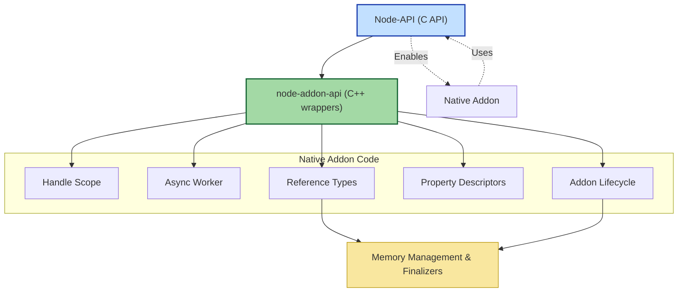

# Core Concepts & Terminology

Welcome to the foundational guide for understanding the core concepts and key terminology essential to mastering **node-addon-api**. This document is designed to quickly get you up to speed with the language and ideas that underpin native addon development using this C++ wrapper framework.

---

## Why This Page Matters

Embarking on native addon development often means bridging two worlds — C++ and JavaScript — with Node.js as the runtime glue. Understanding specialized terms like "Node-API", "handle scope", "async workers", or "property descriptors" empowers you to effectively write, maintain, and debug your C++ addons. This page decodes these terms, helping you gain confidence and clarity early in your journey.

---

## Key Terms & Concepts

### Node-API
Node-API is a stable C-based interface provided by Node.js for building native addons. It guarantees ABI (Application Binary Interface) stability, meaning addons can run across Node.js versions without recompilation. 

- **Purpose**: Abstracts away JavaScript engine internals, allowing native modules to interact consistently with JavaScript.
- **Benefit**: Simplifies cross-version compatibility and enhances addon durability.

### node-addon-api
This is a **header-only C++ wrapper** built on top of Node-API that offers a higher-level, object-oriented API with exception handling semantics specific to C++ developers.

- **Goal**: Provide a natural C++ interface to Node-API, reducing boilerplate and improving code readability.
- **Advantage**: Enables idiomatic C++ styles like classes, exceptions, and strong typing.

### Handle Scope
Handles represent references to JavaScript objects within the native addon code. A **handle scope** defines the lifetime boundary for these handles, ensuring that temporary references are efficiently managed and garbage collected.

- **Why it matters**: Prevents memory leaks by controlling how long native code retains references to JS objects.
- **How it works**: Handles created within a scope are automatically released when the scope ends.

### Async Worker
Asynchronous workers allow you to offload expensive or blocking native computations to a background thread, keeping the Node.js event loop responsive.

- **Core utility**: Execute C++ tasks asynchronously while safely interacting with JavaScript upon completion.
- **User workflow**: Create an AsyncWorker subclass, implement your task, queue it, and handle callbacks.

### Addon Lifecycle
Describes the stages of a native addon from loading to unloading:

- **Initialization**: Native code sets up bindings and class definitions.
- **Runtime interactions**: Handling function calls, async work, property access.
- **Cleanup**: Release resources and unsubscribe any hooks.

Understanding lifecycle helps to manage resources correctly and avoid crashes.

### Property Descriptors
These define characteristics of object properties exposed from native code to JavaScript, such as:

- **Writable**: Can the property be changed?
- **Enumerable**: Will it appear in loops?
- **Configurable**: Can it be deleted or reconfigured?

The descriptors govern how JavaScript interacts with native-exposed members.

### Reference Types
A **reference** is a persistent handle to a JavaScript object, preventing GC from disposing of the object while still needed.

- **Use case**: Cache objects or function references across async calls.
- **Levels**: Strong references keep objects alive, weak references do not.

### Memory Management
Native addons must carefully manage memory across the C++ &lt;-&gt; JavaScript boundary.

- **Handles**: Manage JS references.
- **References**: Extend lifetimes as needed.
- **Finalizers**: Callbacks triggered when JS objects are GC’d, useful for cleaning native memory.

Best practices include minimizing global references and correctly freeing native resources.

---

## Practical Example Flow: Using an Async Worker with Handle Scope

Imagine you need to perform a CPU-intensive task in your addon without blocking JavaScript:

1. You enter a **handle scope** to safely create temporary JS object references.
2. Your native code constructs an **AsyncWorker** subclass overriding the `Execute` method for background processing.
3. The worker queues itself using Node-API async mechanisms.
4. Once processing finishes, it calls a provided JS callback within the addon lifecycle.
5. The handle scope ends, cleaning up any temporary handles.

This flow maintains stability and smooth integration within Node.js.

---

## Common Pitfalls & Tips

- **Not managing handle scopes correctly** can lead to memory leaks or crashes.
- **Ignoring the addon lifecycle** may cause use-after-free errors.
- **Blocking the event loop with sync work** impairs app responsiveness — always prefer async workers.
- Use **property descriptors** thoughtfully to expose only the needed properties with appropriate access levels.
- Leverage **reference types** to store persistent JS objects safely across callbacks.

Adhering to these principles improves addon quality and user experience.

---

## Visual Summary: Core Concept Relationships

---

## Next Steps

Now that you are familiar with the key concepts and terminology, proceed to deepen your understanding by exploring:

- [Setup](../getting-started/setup-basics/system-requirements) to prepare your environment.
- [Your First Addon](../getting-started/first-addon-and-validation/your-first-addon) for hands-on creation.
- [Error Handling](../guides/advanced-best-practices/error-handling) to manage exceptions effectively.

These will build on the core ideas here toward practical mastery.

---

**Empower your native addon journey by mastering these foundational concepts. Master the language, and the rest will follow.**

---