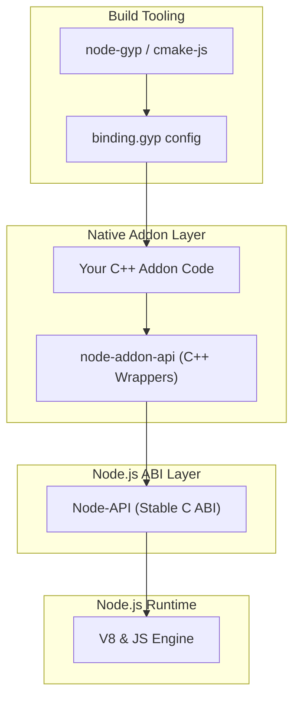

# Integration with Node.js and Build Tools

## Seamless Interoperability with Node.js Runtime and Build Tools

The **Integration with Node.js and Build Tools** page sheds light on how the **node-addon-api** fits effortlessly into the Node.js ecosystem. This key part of the documentation ensures you understand how to bridge your native C++ code with Node.js using Node-API, while leveraging popular build tools like **node-gyp** and **cmake-js**.

### Why This Matters to You

As a developer building native addons for Node.js, your primary goal is to write efficient, maintainable C++ code that integrates seamlessly and reliably with the Node.js runtime across versions. This integration layer abstracts the complexity of Node.js’s internal APIs and ABI changes, so you can focus on your addon logic without worrying about compatibility or build intricacies.

---

## How node-addon-api Works with Node.js and Node-API

At its core, **node-addon-api** provides C++ wrapper classes built on top of Node-API (N-API), a stable C-level ABI introduced by Node.js to guarantee addon stability across versions. This positioning enables your addon to interact with the JavaScript environment without being tied to Node.js internal version specifics.

- **Node-API handles the ABI stability** between Node.js versions, ensuring addons compiled once can run across different Node.js releases without recompilation.
- **node-addon-api wraps Node-API in idiomatic C++ interfaces**, simplifying addon development by adding RAII-style memory management, exceptions, and type safety.

This means your native addon code works harmoniously with the Node.js runtime by using a stable, version-agnostic ABI.

---

## Supported Node.js Versions and ABI Compatibility

**node-addon-api** supports all active Node.js releases providing Node-API, including LTS and current stable lines. This broad support ensures your addon runs reliably in production environments without constant rebuilds for new Node.js releases.

### Automatic Detection

The build process detects the available Node-API version dynamically:

- Reads the `NAPI_VERSION` environment variable or Node.js runtime's version info.
- Configures conditional compilation accordingly to leverage available ABI features.

This automatic adaptation maximizes compatibility and stability without manual intervention.

---

## Including node-addon-api in Your Addon Project

Integrating **node-addon-api** into your native addon requires minimal setup. You incorporate it primarily using your build configuration files.

### Using node-gyp

The primary configuration manifests through **binding.gyp**, Node.js’s default addon build tool:

- **Dependency declaration:** Your addon target depends on the `node_addon_api` target from `node_addon_api.gyp`.
- **Include directories:** The `include_dirs` field includes the node-addon-api directory to expose headers.
- **Compiler flags and defines:** Flags such as `NODE_ADDON_API_ENABLE_TYPE_CHECK_ON_AS` or conditional defines enable or disable features like exceptions, type checking, and `maybe` support.

#### Example `binding.gyp` Excerpts
```json
{
  "targets": [
    {
      "target_name": "binding",
      "dependencies": ["../node_addon_api.gyp:node_addon_api_except"],
      "sources": ["addon.cc", "additional_source_files.cc"],
      "defines": ["NODE_ADDON_API_ENABLE_TYPE_CHECK_ON_AS"]
    }
  ]
}
```

This snippet shows how your addon "binding" depends on `node_addon_api_except` that enables C++ exception support. Additional build variants exist for more granular control.

### Using cmake-js

While not covered in code snippets here, the document explains compatibility with **cmake-js**, an alternative build system preferred by some projects. It details how to configure your `CMakeLists.txt` to include node-addon-api headers and libraries accordingly.

---

## Build Configuration Options and Variants

The node-addon-api build system supports multiple build variants enabling you to tailor compilation to your project's needs:

- **Exception Support:** Variants like `node_addon_api_except`, `node_addon_api_except_all`, and `node_addon_api_noexcept` control exception handling.
- **Maybe Support:** Using the `NODE_ADDON_API_ENABLE_MAYBE` flag toggles advanced `Maybe` and `MaybeLocal` handling.
- **Namespace Customization:** You can define a custom namespace via `NAPI_CPP_CUSTOM_NAMESPACE` for projects needing non-default namespaces.

Each variant is selectable by adjusting dependencies and defines in your `binding.gyp`. This modular setup helps balance performance, safety, and compatibility.

---

## Typical User Workflow: Adding node-addon-api to Your Addon

1. **Configure your build tool:** Modify `binding.gyp` to include node-addon-api targets and relevant flags.
2. **Include Headers:** Add `#include <napi.h>` in your C++ addon source files.
3. **Leverage C++ Wrappers:** Use node-addon-api C++ classes to interface with JavaScript values, objects, and async workflows.
4. **Build and Test:** Run `node-gyp build` or your preferred build tool, then test in Node.js.

This streamlined process reduces boilerplate and enhances your developer experience.

---

## Practical Tips and Best Practices

- **Always match Node.js and Node-API versions:** Ensure your build environment uses compatible Node-API headers to avoid runtime mismatches.
- **Leverage build variants carefully:** Enable exceptions or `Maybe` only if your addon logic needs them to avoid unnecessary overhead.
- **Consult the system architecture overview** for insights on how node-addon-api fits in the full Node.js addon ecosystem.
- **Use version management best practices** to handle compatibility across diverse Node.js deployments.

---

## Troubleshooting Common Issues

<AccordionGroup title="Common Build and Integration Issues">
<Accordion title="Build Fails Due to Missing Headers or Dependencies">
Ensure your `binding.gyp` lists the node_addon_api dependency correctly and that your include paths are accurate. Confirm Node-API headers are installed for your Node.js version.
</Accordion>
<Accordion title="Runtime Errors on Node.js Version Upgrades">
Verify that your addon is built using Node-API and not internal Node.js APIs to exploit ABI stability. Rebuild using correct NAPI_VERSION if needed.
</Accordion>
<Accordion title="Conflicts When Using Multiple Namespace Definitions">
Avoid mix-matching default and custom namespaces in your source and build files. Choose one consistent approach per project.
</Accordion>
</AccordionGroup>

---

## Visualizing the Integration



This flow demonstrates how your C++ source integrates with node-addon-api, which internally calls Node-API's stable C interface, serving as a bridge to the actual Node.js runtime. Build tools like node-gyp orchestrate compiling and linking these parts.

---

## Summary

This page equips you with a clear understanding of how **node-addon-api** integrates into your Node.js native addon projects by explaining runtime interoperability, ABI stability, and build tool configurations. Following these guidelines ensures your addon is future-proof, maintainable, and easy to build across different environments.

For hands-on implementation, proceed to the **Getting Started** guides on **Installation** and **Creating Your First Addon** to apply these integration principles immediately.

---

# References

- [node-addon-api GitHub Repository](https://github.com/nodejs/node-addon-api)
- [Getting Started - Installation Instructions](/getting-started/setup-basics/install-instructions)
- [Creating Your First Addon](/getting-started/first-addon-and-validation/your-first-addon)
- [System Architecture Overview](/overview/architecture-and-concepts/system-architecture)
- [Building and Integration Best Practices](/concepts/advanced-patterns/integration-tooling)

---

_By mastering the integration of node-addon-api with Node.js and your build system, you eliminate boilerplate and compatibility pains, unlocking the full potential of native addons across any Node.js environment._
