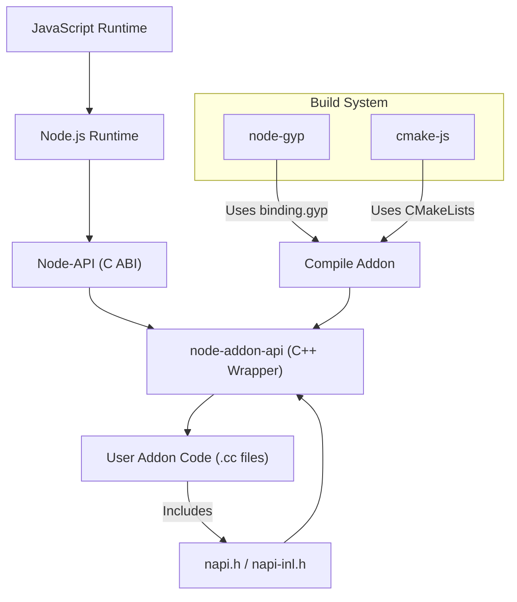

# System Architecture Overview

Welcome to the System Architecture Overview of **node-addon-api** — your high-level guide to understanding how the C++ wrapper interfaces seamlessly with Node.js through Node-API. This page maps out the fundamental layering and integration points that empower native addon development, illustrating how user code fits into the larger ecosystem and how build systems incorporate and compile these components.

---

## Why This Overview Matters

When building native Node.js addons, understanding the architecture clarifies how **node-addon-api** operates under the hood without requiring deep dives into internal implementation. This empowers you to configure your build environment correctly, troubleshoot integration issues, and write efficient, maintainable native modules.

---

## What You Will Learn Here

- The relationship between **node-addon-api** C++ wrappers and the underlying Node-API C ABI.
- How this layered design benefits addon developers.
- Integration of **node-addon-api** into common build systems like **node-gyp** and **cmake-js**.
- The structure and role of header files.
- The key interaction points where your native addon code engages with the system.

---

## The Architecture at a Glance

**node-addon-api** acts as a C++ abstraction layer over the Node-API C interface. The core design stacks as follows:

- **Node.js Runtime:** The JavaScript engine and environment where addons run.
- **Node-API (C ABI):** A stable C interface designed to insulate native modules from changes in the underlying JavaScript engine (V8, Chakra, etc.).
- **node-addon-api (C++ Wrapper):** Convenient C++ classes that wrap these C API calls for safer, easier addon development.

### Benefits of This Layering

- **ABI Stability:** Writing against Node-API guarantees binary compatibility across Node.js versions.
- **Productivity:** The C++ wrappers reduce boilerplate, provide RAII memory management, and support C++ exception integration.
- **Modularity:** Your addon code interacts solely with the C++ layer without worrying about Node-API internals or engine specifics.

---

## How node-addon-api Integrates with Build Systems

Building your addon involves compiling C++ source against these layers. The most common build tools are **node-gyp** and **cmake-js**, both leveraging `binding.gyp` files to configure compilation.

### The binding.gyp Role

The `binding.gyp` file governs:

- Source files to compile (your addon and supporting code).
- Include directories (for headers like `napi.h`).
- Preprocessor definitions controlling exception handling and other build options.
- Dependencies on `node_addon_api.gyp` targets that bring in the node-addon-api headers and configuration.

<CodeGroup>
```json
{
  "targets": [
    {
      "target_name": "node_addon_api",
      "type": "none",
      "sources": ["napi.h", "napi-inl.h"],
      "direct_dependent_settings": {
        "include_dirs": ["."],
        "includes": ["noexcept.gypi"]
      }
    }
  ]
}
```
```gyp
{
  "targets": [
    {
      "target_name": "addon",
      "sources": ["addon.cc"],
      "include_dirs": [ "<!@(node -p \"require('node-addon-api').include_dir\")" ],
      "defines": ["NAPI_CPP_EXCEPTIONS"],
      "dependencies": ["<(node-addon-api.gyp):node_addon_api"]
    }
  ]
}
```
</CodeGroup>

### Exception Handling Configurations

You can toggle exception integration between your C++ and JavaScript code through specific dependencies in your build configuration. For example:

- Default no exception support: `node_addon_api`
- Catch only exceptions derived from `Napi::Error`: `node_addon_api_except`
- Catch all C++ exceptions: `node_addon_api_except_all`

These options correspond to variations in `node_addon_api.gyp` and linked build files.

---

## Structure of Header Files

The two primary headers supplied by node-addon-api are:

- `napi.h`
- `napi-inl.h`

`napi.h` declares the classes and APIs, while `napi-inl.h` provides inline implementations. They are included together during compilation and represent the entire API surface you interact with.

### Key Points

- Do **not** include internal headers such as `node.h`, `nan.h`, or `v8.h` to maintain ABI stability.
- These headers encapsulate the C Node-API and simplify memory, property, and error management via C++ abstractions.

---

## Where Your User Code Fits

Your native addon code resides in C++ source files (e.g., `addon.cc`). These files:

- Include `napi.h` to access node-addon-api features.
- Define an initialization function that registers your module with Node.js.
- Use C++ classes (e.g., `Napi::Object`, `Napi::Function`) to interact with JavaScript values.

### Example Snippet

```cpp
#include <napi.h>

Napi::Object Init(Napi::Env env, Napi::Object exports) {
  // Add properties or functions to exports object
  return exports;
}

// Registers the module with the specified initialization function
NODE_API_MODULE(NODE_GYP_MODULE_NAME, Init)
```

This entrypoint function ties your code into the full stack from JavaScript through Node.js down to native C++.

---

## Visualizing the Flow



---

## Tips for Success

- Always include `napi.h` in your C++ source and avoid other internal headers.
- Ensure your `binding.gyp` correctly references the `node-addon-api` dependency matching your exception handling preferences.
- On macOS, configure your build to hide visibility for symbols to prevent linkage issues.
- Use the predefined macro `NODE_GYP_MODULE_NAME` to ensure the target name remains consistent between build and runtime.

---

## Common Pitfalls & Troubleshooting

<AccordionGroup title="Troubleshooting Common Issues">
<Accordion title="Missing Include Directories or Headers">
Make sure your `include_dirs` in `binding.gyp` include `"<!@(node -p \"require('node-addon-api').include_dir\")"`. Forgetting this causes compilation errors related to missing `napi.h`.
</Accordion>
<Accordion title="Mismatch in node-addon-api Dependency">
Check that your `dependencies` in `binding.gyp` uses the same target as your exception handling setup. Using `node_addon_api_except_all` vs `node_addon_api` impacts which exceptions are caught.
</Accordion>
<Accordion title="Build Failures on macOS">
Verify your `binding.gyp` contains macOS-specific visibility flags and deployment target to avoid linker errors.
</Accordion>
</AccordionGroup>

---

## Next Steps

Now that you have a clear architectural picture, proceed to:

- [Integration with Node.js and Build Tools](/overview/architecture-and-concepts/integration-points): Deep dive into configuring your build and runtime environment.
- [Creating Your First Addon](/getting-started/first-addon-and-validation/your-first-addon): Start writing your native extension code following practical, guided steps.
- [Error Handling and Exception Propagation](/api-reference/error-handling-lifecycle/error-exceptions): Learn how exceptions and errors are managed through these layers.

Following these guides will help you translate understanding into effective native addon development.

---