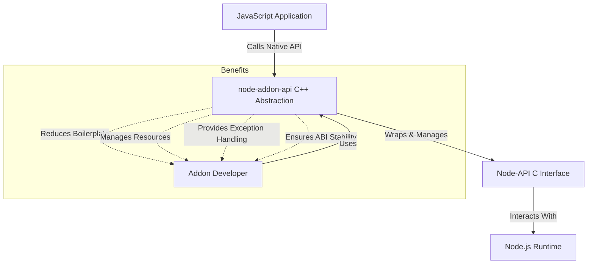

# Why Use node-addon-api?

Unlock the power of seamless, efficient, and maintainable C++ addons for Node.js development. The **node-addon-api** serves as a robust C++ wrapper around Node-API, specifically designed to simplify native addon development by reducing boilerplate code, managing resources effectively, and ensuring stability across Node.js versions.

---

## Simplifying Native Module Development

Building native addons directly with Node-API can be challenging, often requiring verbose code and careful manual resource management. **node-addon-api** transforms this experience by offering a high-level, object-oriented C++ API that abstracts low-level details, letting you focus on your addon’s core logic instead of mundane plumbing.

### What Problems Does node-addon-api Solve?

- **Minimizes Boilerplate Code:** Streamlined classes and patterns reduce repetitiveness and improve coding efficiency.
- **Automates Resource Management:** Effectively handles lifetime and memory management for JS objects and native resources, preventing leaks and crashes.
- **Brings C++ Exception Support:** Integrates standard C++ exception handling mechanisms, enabling safer and more idiomatic error management.
- **Ensures ABI and API Stability:** Shields your addon from breaking changes across Node.js versions, drastically reducing maintenance overhead.
- **Enhances Maintainability:** Clear, idiomatic C++ interfaces simplify addon evolution and debugging.

### The Enhanced C++ Experience

By wrapping Node-API’s C-based interface, node-addon-api offers intuitive C++ classes and functions that handle typical tasks like:

- Creating and manipulating JavaScript values
- Defining classes, methods, and properties exposed to JavaScript
- Managing async workflows and callback lifecycles
- Handling errors and propagating exceptions safely

This means developers don’t need to manually manage `napi_value` handles or deal with repetitive error checks, turning complex native development tasks into cleaner, maintainable code.

## Key Enhancements and Benefits

### 1. C++ Exception Handling

Enables use of native C++ exceptions inside addon code, integrating seamlessly with Node’s error propagation:

```cpp
// Throwing a JS exception via C++
Napi::Error::New(env, "Invalid argument").ThrowAsJavaScriptException();

// Using native C++ try-catch blocks
try {
  // code that may throw
} catch (const std::exception& e) {
  Napi::Error::New(env, e.what()).ThrowAsJavaScriptException();
}
```

This enhancement helps keep error handling concise and idiomatic without sacrificing safety.

### 2. ABI and API Stability Across Node.js Versions

Node.js evolves rapidly and underlying APIs can shift. **node-addon-api** acts as a compatibility layer, insulating your code from these changes by:

- Using a stable interface that adapts internally
- Abstracting away version-specific details
- Enabling addons to build once and run consistently on multiple Node.js releases

This saves extensive time spent on compatibility adjustments and retesting across environments.

### 3. Simplified Resource and Memory Management

Native addon development involves managing JavaScript objects’ lifetimes alongside C++ resources. node-addon-api: 

- Provides smart wrappers like `Napi::ObjectWrap` to bind C++ classes to JS objects with automatic cleanup
- Integrates with Node.js’s GC safely
- Allows you to attach native data and finalizers cleanly

Example:

```cpp
class MyObject : public Napi::ObjectWrap<MyObject> {
  public:
    MyObject(const Napi::CallbackInfo& info) : Napi::ObjectWrap<MyObject>(info) {
      // Constructor logic here
    }
    
    ~MyObject() {
      // Destructor for cleanup
    }
};
```

### 4. Reduced Boilerplate and Improved Readability

By replacing verbose C-based APIs with expressive C++ classes and methods, your addon code becomes:

- More concise and focused
- Easier to read, maintain, and refactor
- Leveraging C++ language features and patterns naturally

## Real-World Impact: What Can You Achieve?

Imagine developing a cross-platform addon that deals with asynchronous I/O and complex data structures. Using node-addon-api, you can:

- Write clear class abstractions that expose native capabilities as JavaScript classes
- Handle asynchronous callbacks safely without manual thread management
- Propagate exceptions cleanly from C++ to JavaScript
- Support all active Node.js releases without repeated rebuilds or hacks

Before node-addon-api, you'd wrestle with manual handle scopes, error checks, and breaking API changes. Today, you accelerate addon delivery while reducing technical debt.

## Practical Tips for Success

- **Leverage ObjectWrap:** Use `Napi::ObjectWrap` to bind native classes to JS for automatic lifetime handling.
- **Use Exceptions Wisely:** Throw C++ exceptions to simplify error paths, but handle them properly.
- **Stay Updated:** Keep the node-addon-api package up to date to benefit from compatibility fixes and improvements.
- **Write Clean Init Functions:** Take advantage of the elegant addon initialization patterns the library offers.

## Summary

**node-addon-api** elevates native addon development by offering a modern, stable, and developer-friendly C++ interface atop Node-API. It solves critical pain points—boilerplate, resource management, exception handling, and cross-version stability—enabling you to build robust native modules with confidence and efficiency.

---

## Getting Started

Ready to harness these benefits? Begin by exploring the [Creating Your First Addon](../getting-started/first-addon-and-validation/your-first-addon) guide to see node-addon-api in action. For configuration details, visit [Setup and Build System Integration](../api-reference/integration-build/setup-build).

<Tip>
Always verify your development environment meets the prerequisites before starting native addon work to ensure seamless builds and runtime behavior.
</Tip>

---

## Additional Resources

- [What is node-addon-api?](./what-is-node-addon-api) — Understand the foundation and purpose.
- [Core Concepts & Terminology](../overview/architecture-and-concepts/core-concepts-and-terminology) — Get familiar with key API components.
- [Error Handling and Exception Propagation](../api-reference/error-handling-lifecycle/error-exceptions) — Deep dive into error management.
- [Versioning and Node Compatibility](../concepts/integration-and-workflows/versioning-compatibility) — Stay compatible across Node.js releases.

---

## Troubleshooting

**Common Pitfalls:**

- Forgetting to use `Napi::ObjectWrap` for object lifetime can lead to memory leaks.
- Not properly throwing exceptions or handling them can crash your addon at runtime.
- Ignoring Node.js version compatibility can cause unexpected failures.

If you encounter issues, consult the [Troubleshooting Setup Issues](../getting-started/troubleshooting/troubleshooting-guide) page or file an issue on the [node-addon-api GitHub](https://github.com/nodejs/node-addon-api/issues).


---

## Diagram: Simplified User View of node-addon-api's Role



This flow captures how node-addon-api fits into the development ecosystem, providing a clear interface for developers while working behind the scenes to maintain compatibility and efficiency.

---

For detailed API usage and examples, see the [API Reference](../api-reference/core-cpp-api/value-types) section.

---